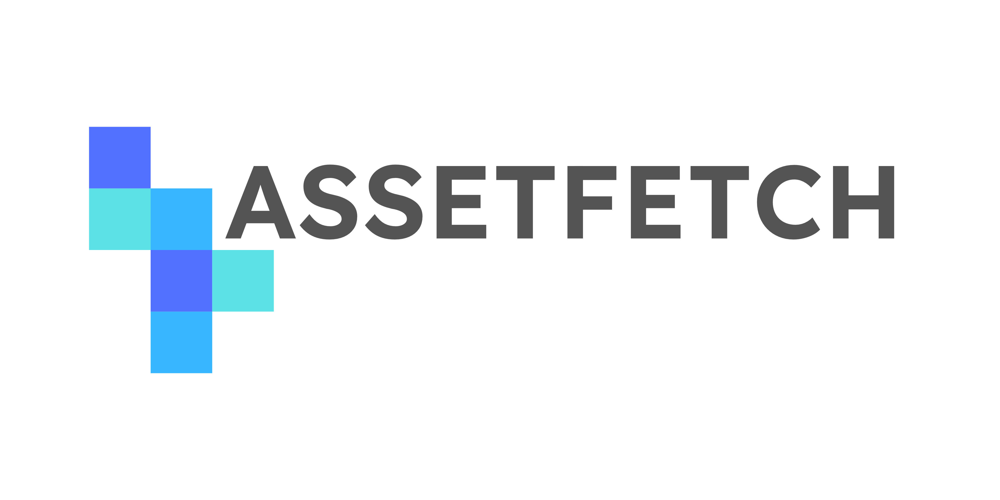

	

# The AssetFetch Specification

**AssetFetch** is an HTTP- and JSON-based system for browsing, retrieving and handling/importing digital assets for media creation.
The AssetFetch Protocol aims to provide a standardized way for artists to browse libraries of downloadable assets offered by providers *outside* their current production environment/pipeline, such as those of commercial or free 3D asset vendors, marketplaces or other repositories of models, textures or adjacent kinds of digital assets.

It aims to create an artist experience similar to existing proprietary import plugins with less development overhead in order to increase interoperability between vendors and applications and allow more vendors - especially smaller ones - to offer their assets to artists right in the applications where they need them.

# Features

- Header-based Authentication.
- Browsing assets with thumbnails, server-side searching and filtering, license data, author data and more.
- Support for multiple resolutions, quality levels or any other kind of variation of assets.
- Support for zipped downloads: Providers can still send metadata for individual asset files, even if the actual download arrives in just one zip file.
- Ways for checking compatibility with different open or vendor-native formats: The provider offers metadata for multiple versions of the same asset which the client can use to judge whether it will be able to actually import the file BEFORE downloading it, as best as possible (100% certainty will be impossible).
- Purchasing assets (even composite assets that require multiple purchases) through an "asset unlocking" system. The actual payment isn't handled by AF, users still need to sign up on the provider's website.
- Ways of linking loose files together to cover "loose materials" to make the distribution of PBR materials and HDRIs easier.
- Theming and branding options for providers with banner images, if the client chooses to display those.
- Custom metadata for common file formats.

# This is a Work-In-Progress
Everything here at the moment should be regarded as a starting-off point for future testing and discussion about how the transfer of 3D assets from vendors to clients can be made made more open and interoperable.
There are still numerous milestones to hit before a version 1.0 can be released:

- Create better examples for basically everything. This includes examples for every element of the specification as well as more general examples and user stories to better illustrate what AssetFetch is, how it works and the value it delivers both for asset vendors and users.

- Create proof-of-concept implementations both for the provider- and the client-side in order to demonstrate the viability of the entire system. This will also inevitably lead to changes and clarifications in the spec as problems are encountered and (hopefully) solved.

- Create more extension-specific datablock definitions for many more formats, both open and application-specific ones (`max`(3DSMax),`ma/mb`(Maya),`uasset`(Unreal Engine),`usda/c/z` (OpenUSD), `gltf/b`(GLTF),...) 

- ...

# JSON Schema

JSON-Schemas for AssetFetch are provided in the `/json-schema` subdirectory of this repository.

# Contributing

The best way to contribute at this stage is by opening issues with questions, contradictions in the specifications, suggestions for datablocks or any other thoughts about the specification.

The specification document is written in markdown and therefore easily editable with any text editor.
However, the recommended environment for editing `spec.md` is Visual Studio Code with the following extensions:

- Markdown Preview Mermaid Support (`bierner.markdown-mermaid`)
- Markdown All-In-One (`yzhang.markdown-all-in-one`)

To maintain proper document structure, the commands "Format Document" and "Markdown-All-In-One: Add/Update section Numbers" should be used.
All PRs are tested for dead markdown links and syntax issues in the JSON schema.
