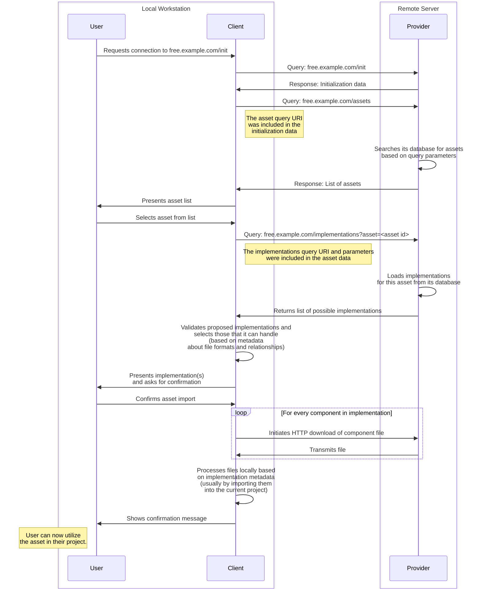
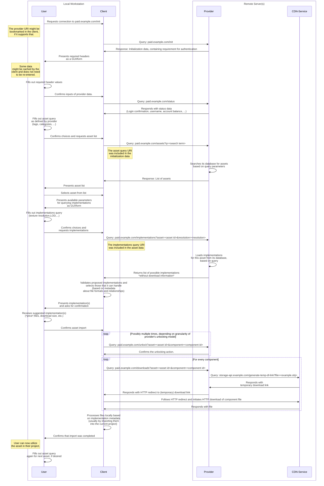

This document specifies **AssetFetch v0.4**, an HTTP- and JSON-based system for 3D asset discovery, retrieval and handling/import inside of Digital Content Creation (DCC) apps.
The AssetFetch Protocol aims to provide a standardized way for artists to browse libraries of downloadable assets offered by providers *outside* their current production environment or pipeline, such as those of commercial or non-profit 3D asset vendors, marketplaces or other repositories of models, textures or other kinds of assets for digital media production.

- [1. Introduction](#1-introduction)
	- [1.1. Motivation](#11-motivation)
	- [1.2. Vision](#12-vision)
	- [1.3. Goals](#13-goals)
	- [1.4. Non-Goals](#14-non-goals)
- [2. Terminology](#2-terminology)
	- [2.1. Provider](#21-provider)
	- [2.2. Client](#22-client)
	- [2.3. Host Application](#23-host-application)
	- [2.4. User](#24-user)
	- [2.5. Asset](#25-asset)
	- [2.6. (Asset-)Implementation](#26-asset-implementation)
		- [2.6.1. Implementation Directory](#261-implementation-directory)
	- [2.7. (Implementation-)Component](#27-implementation-component)
		- [2.7.1. Component "Activeness"](#271-component-activeness)
	- [2.8. Datablock](#28-datablock)
	- [2.9. Component Unlocking](#29-component-unlocking)
- [3. General Operation](#3-general-operation)
	- [3.1. Overview](#31-overview)
	- [3.2. Initialization](#32-initialization)
	- [3.3. Authentication \& Connection Status (optional)](#33-authentication--connection-status-optional)
	- [3.4. Browsing Assets](#34-browsing-assets)
		- [3.4.1. Asset Filtering](#341-asset-filtering)
		- [3.4.2. Asset Selection](#342-asset-selection)
	- [3.5. Implementation Negotiation](#35-implementation-negotiation)
		- [3.5.1. Implementation Filtering](#351-implementation-filtering)
		- [3.5.2. Implementation Selection](#352-implementation-selection)
	- [3.6. Component Unlocking (optional)](#36-component-unlocking-optional)
	- [3.7. Downloading](#37-downloading)
	- [3.8. Handling](#38-handling)
	- [3.9. Sequence Diagram](#39-sequence-diagram)
		- [3.9.1. Simple Version](#391-simple-version)
		- [3.9.2. Complete Version](#392-complete-version)
- [4. HTTP Communication](#4-http-communication)
	- [4.1. Request Payloads](#41-request-payloads)
	- [4.2. Response Payloads](#42-response-payloads)
	- [4.3. User-Agent](#43-user-agent)
	- [4.4. Variable and Fixed Queries](#44-variable-and-fixed-queries)
		- [4.4.1. Variable Query](#441-variable-query)
			- [4.4.1.1. Variable Query Parameters](#4411-variable-query-parameters)
		- [4.4.2. Fixed Query](#442-fixed-query)
	- [4.5. HTTP Codes and Error Handling](#45-http-codes-and-error-handling)
- [5. Endpoints](#5-endpoints)
	- [5.1. About Endpoints](#51-about-endpoints)
	- [5.2. Response Data Templates](#52-response-data-templates)
		- [5.2.1. The `meta` Template](#521-the-meta-template)
		- [5.2.2. The `datablock_collection` Template](#522-the-datablock_collection-template)
			- [5.2.2.1. Example](#5221-example)
	- [5.3. Endpoint: Initialization (`initialization`)](#53-endpoint-initialization-initialization)
	- [5.4. Endpoint: Asset List (`asset_list`)](#54-endpoint-asset-list-asset_list)
		- [5.4.1. `asset` Structure](#541-asset-structure)
	- [5.5. Endpoint: Implementation List (`implementation_list`)](#55-endpoint-implementation-list-implementation_list)
		- [5.5.1. `implementation` Structure](#551-implementation-structure)
		- [5.5.2. `component` Structure](#552-component-structure)
	- [5.6. Endpoint: Unlocking (`unlock`)](#56-endpoint-unlocking-unlock)
	- [5.7. Endpoint: Connection Status (`connection_status`)](#57-endpoint-connection-status-connection_status)
- [6. Datablocks](#6-datablocks)
	- [6.1. Datablock Names](#61-datablock-names)
	- [6.2. Datablock Value Templates](#62-datablock-value-templates)
		- [6.2.1. `variable_query`](#621-variable_query)
			- [6.2.1.1. `parameter` Structure](#6211-parameter-structure)
			- [6.2.1.2. `choice` Structure](#6212-choice-structure)
		- [6.2.2. `fixed_query`](#622-fixed_query)
- [7. Datablock Index](#7-datablock-index)
	- [7.1. Configuration and authentication-related datablocks](#71-configuration-and-authentication-related-datablocks)
		- [7.1.1. `provider_configuration`](#711-provider_configuration)
			- [7.1.1.1. `header` structure](#7111-header-structure)
		- [7.1.2. `provider_reconfiguration`](#712-provider_reconfiguration)
		- [7.1.3. `user`](#713-user)
	- [7.2. Browsing-related Datablocks](#72-browsing-related-datablocks)
		- [7.2.1. `asset_list_query`](#721-asset_list_query)
		- [7.2.2. `implementation_list_query`](#722-implementation_list_query)
		- [7.2.3. `next_query`](#723-next_query)
		- [7.2.4. `response_statistics`](#724-response_statistics)
	- [7.3. Display-related Datablocks](#73-display-related-datablocks)
		- [7.3.1. `text`](#731-text)
		- [7.3.2. `web_references`](#732-web_references)
		- [7.3.3. `branding`](#733-branding)
		- [7.3.4. `license`](#734-license)
		- [7.3.5. `authors`](#735-authors)
		- [7.3.6. `dimensions`](#736-dimensions)
		- [7.3.7. `preview_image_supplemental`](#737-preview_image_supplemental)
		- [7.3.8. `preview_image_thumbnail`](#738-preview_image_thumbnail)
			- [7.3.8.1. `uris` Structure](#7381-uris-structure)
		- [7.3.9. `keywords`](#739-keywords)
	- [7.4. Unlocking-related Datablocks](#74-unlocking-related-datablocks)
		- [7.4.1. `unlock_balance`](#741-unlock_balance)
		- [7.4.2. `unlock_queries`](#742-unlock_queries)
			- [7.4.2.1. `unlock_query` structure](#7421-unlock_query-structure)
	- [7.5. Format-related Datablocks](#75-format-related-datablocks)
		- [7.5.1. `format`](#751-format)
			- [7.5.1.1. `extension` rules](#7511-extension-rules)
			- [7.5.1.2. `mediatype` rules](#7512-mediatype-rules)
		- [7.5.2. `format.blend`](#752-formatblend)
			- [7.5.2.1. `target` Structure](#7521-target-structure)
		- [7.5.3. `format.obj`](#753-formatobj)
	- [7.6. Fetching- and Storage-related Datablocks](#76-fetching--and-storage-related-datablocks)
		- [7.6.1. `fetch.download`](#761-fetchdownload)
		- [7.6.2. `fetch.from_archive`](#762-fetchfrom_archive)
		- [7.6.3. `store`](#763-store)
			- [7.6.3.1. `local_file_path` rules](#7631-local_file_path-rules)
	- [7.7. Handling/Processing-related Datablocks](#77-handlingprocessing-related-datablocks)
		- [7.7.1. `handle.native`](#771-handlenative)
		- [7.7.2. `handle.archive`](#772-handlearchive)
			- [7.7.2.1. `local_directory_path` rules](#7721-local_directory_path-rules)
		- [7.7.3. `handle.loose_environment_map`](#773-handleloose_environment_map)
		- [7.7.4. `handle.loose_material_map`](#774-handleloose_material_map)
	- [7.8. Linking-related Datablocks](#78-linking-related-datablocks)
		- [7.8.1. `link.loose_material`](#781-linkloose_material)
		- [7.8.2. `link.mtlx_material`](#782-linkmtlx_material)
- [8. Working With Asset Implementations](#8-working-with-asset-implementations)
	- [8.1. Overview](#81-overview)
	- [8.2. Implementation Analysis](#82-implementation-analysis)
	- [8.3. Performing Unlock Queries](#83-performing-unlock-queries)
	- [8.4. Choosing a Local Directory](#84-choosing-a-local-directory)
	- [8.5. Downloading and Storing Files](#85-downloading-and-storing-files)
		- [8.5.1. Storing All Component Files Based on `store` Datablock](#851-storing-all-component-files-based-on-store-datablock)
		- [8.5.2. Interacting With Archives (components with `handle.archive` datablock)](#852-interacting-with-archives-components-with-handlearchive-datablock)
			- [8.5.2.1. Handling for `extract_fully=true`](#8521-handling-for-extract_fullytrue)
			- [8.5.2.2. Handling for `extract_fully=false`](#8522-handling-for-extract_fullyfalse)
			- [8.5.2.3. Deleting Archives](#8523-deleting-archives)
	- [8.6. Handling Component Files](#86-handling-component-files)
		- [8.6.1. Handling For Components Without a  `handle.*` Datablock](#861-handling-for-components-without-a--handle-datablock)
		- [8.6.2. Handling based on the native handling datablock (`handle.native`)](#862-handling-based-on-the-native-handling-datablock-handlenative)
		- [8.6.3. Handling a Loose Material Map (`handle.loose_material_map`)](#863-handling-a-loose-material-map-handleloose_material_map)
		- [8.6.4. Handling a Loose Environment Map (`handle.loose_environment_map`)](#864-handling-a-loose-environment-map-handleloose_environment_map)
	- [8.7. Handling Component Links](#87-handling-component-links)
		- [8.7.1. Handling MTLX Material Links (`link.mtlx_material`)](#871-handling-mtlx-material-links-linkmtlx_material)
		- [8.7.2. Handling loose Material Links (`link.loose_material`)](#872-handling-loose-material-links-linkloose_material)
- [9. Security Considerations](#9-security-considerations)
	- [9.1. Storing Sensitive Headers](#91-storing-sensitive-headers)
	- [9.2. Avoiding Relative Paths in Local Path Fields](#92-avoiding-relative-paths-in-local-path-fields)
	- [9.3. Self-referential Archive Components](#93-self-referential-archive-components)


# 1. Introduction

## 1.1. Motivation

Acquiring pre-made assets for use in a project usually involves visiting the website of a vendor offering 3D models, material or other resources and downloading one or multiple files to local storage.
These asset files are then manually imported into the desired DCC application, a process which often involves additional steps for unpacking, file organization and adjustments after the initial import such as manually setting up a material from texture maps that came with a model file.

When trying to work with a large volume of third-party assets this workflow can become rather laborious, even more so when trying to experiment with multiple assets to see which works best in a scene.
Recognizing this issue, multiple vendors have started creating bespoke solutions that allow artists to browse an individual vendor's asset library in a much more integrated fashion, for example through an additional window or panel integrated into the graphical user interface in a 3D suite.
This vastly improves the user experience of browsing, downloading and importing assets and helps artists to focus on their core creative objective.

However, these solutions are usually implemented using addons/plugins and are hard-coded to work with one 3D suite and one vendor, which creates a new set of issues:

Vendors wanting to offer this improved user experience for their customers find themselves needing to build and maintain multiple pieces of software with limited opportunities for code reuse as every new plugin must be built within the language, framework and constraints presented by the host application.

In light of this, many vendors choose to only offer a native integration for one or two applications or no native integrations at all.
This may be because they don't have the resources and skills required or because development of such systems is not justifiable from a business perspective.

Conversely, large vendors who can afford to develop and continuously maintain native integrations for many different DCC applications can benefit from a lock-in effect as only they can provide the convenience and speed that artists are accustomed to - limiting artist's choices.

## 1.2. Vision

The AssetFetch system aims to create an artist experience similar to the existing native integrations with less development overhead in order to increase interoperability between vendors and DCC applications to allow more vendors - especially smaller ones - to offer their assets to artists right in the DCC applications where they need them.

## 1.3. Goals

These are the goals of the AssetFetch specification, outlined in this document:

- Describe a flexible, extensible way of discovering, filtering and previewing assets.
- Facilitate the *one-time and one-directional transfer* of an asset with all its files from a provider to a client.
- Allow providers to describe the structure of their assets (i.e. how the files they provide should work together) in a machine-readable way that allows for semi- or fully-automated handling of assets on the client-side with the smallest possible amount of manual adjustments.
<br><br>
- Work without custom code that is specific for one vendor-application combination.
- Make offering assets a low-threshold process for implementors on the provider side.
- Allow implementors on the client side (for whom the implementation is likely harder) to easily get to an MVP-stage and gradually build out their implementations from there.

## 1.4. Non-Goals

In order to maintain focus and make the implementation achievable with a reasonable amount of effort AssetFetch does not want to:

- Act as a full asset management system for project- or studio-internal use, i.e. one that permanently tracks potentially evolving assets within an ongoing production. AssetFetch shares some ideas and data structures from [OpenAssetIO](https://openassetio.org/) but is not meant as a competitor or replacement for it, rather as a supplementary system. It might even be possible to run AssetFetch on top of OpenAssetIO in future versions.
- Act as a new file format for describing complex 3D scenes in great detail. This is left to [OpenUSD](https://openusd.org) or [MaterialX](https://materialx.org/). Instead, the focus lies on describing the interactions and relationships between files with existing, well-known file formats.

# 2. Terminology

This section describes several key terms that will be used throughout this document.

## 2.1. Provider
>The actor that offers assets by hosting an AssetFetch-compliant HTTP(S)-Endpoint.

This provider can be a commercial platform that is offering 3D assets for sale or an open repository providing content for free.
The provider hosts the AssetFetch API as an HTTP(s)-based service.


## 2.2. Client
>A piece of software built to interact with the AssetFetch-API of a provider in order to receive resources from it.

## 2.3. Host Application
>An application into which the client is integrated.

A client can be a standalone application but in most implementation scenarios it will likely be integrated into another host application, like a 3D suite or other DCC application, in the form of a plugin/addon.
The crucial difference to existing provider-specific plugins/addons is that only one implementation needs to be developed and maintained per application, instead of one per provider-application pairing.
In reality there may of course still be multiple client plugins developed for the same application, but the choice for one of them should have less of an impact.

## 2.4. User
>The human who uses an AssetFetch client.


## 2.5. Asset
>A reusable *logical* media element in the context of a digital project.

The emphasis is put on the term "logical" to indicate that one asset does not necessarily represent a single file.
It might be composed of one or multiple meshes, textures, bones, particle systems, simulation data, etc. that are kept in multiple files.

- A model of a chair with its mesh and textures is considered one asset.
- An HDRI environment map is considered one asset.
- A character model with textures and a rig is considered one asset.

## 2.6. (Asset-)Implementation
> A concrete collection of components (files) that represents an asset in exactly one way for one specific use case, potentially even just for one specific application.

When describing the transfer of assets from a provider to a client it is common for the provider to have the same asset available in many different variations.

These variations may be:
- Small semantic variations, like different colors or design alterations that do not change the nature of the asset so much that it becomes a new asset.
- Quality variations, like multiple texture resolutions or LODs (Levels of Detail) for a mesh.
- Purely technical variations, like offering the same asset with the same general level of technical fidelity in multiple file formats and file-arrangements for different applications.

Some vendors allow their users to control these parameters with great precision so that they only need to download the asset in exactly the format and quality that is desired.
This exact choice - or rather the collection of files with metadata that is a result of it - is considered an  "**implementation** of an asset".

- An OBJ file containing the LOD1 mesh of a chair along with a set of TIFF texture maps measuring 512x512 pixels each is considered one implementation of the chair asset. Using the LOD0 version instead would be considered a *new implementation* of the *same chair asset*.
- An EXR image with a resolution of 8192x4096 pixels in an equirectangular projection is considered one implementation of an HDRI environment.
- A BLEND file containing a character model, its rig and all its textures (again with a specific resolution) all packed into it is considered one implementation.
- A UASSET file containing the same character set up for Unreal Engine instead of Blender is considered a different implementation of the same character asset.

### 2.6.1. Implementation Directory
Every asset implementation has its own directory in which all component files for it are stored by the client after downloading them.
This is referred to as the "implementation directory".
A new one is created for every asset implementation that the client downloads.

## 2.7. (Implementation-)Component
> A piece of digital information, generally a file, that is part of an asset implementation.

- The 512px TIFF roughness map of the aforementioned chair implementation is one component.
- The EXR file containing the panoramic environment is a component. It happens to be the only component in the implementation of that environment.
- The BLEND file with the character model and textures packed into it is also considered one component since the BLEND file is a black box for any program except Blender.
- When working with archives, the archive itself as well as its contents are considered components.
A ZIP archive with the chair model as an FBX file and its textures as PNG files is represented as one component for the ZIP archive and then one component for each file in it (with some exceptions when using specific archive unpacking configurations).

### 2.7.1. Component "Activeness"
Not all components of an implementation must be actively processed by the client in order to use them and are instead handled implicitly by the host application.

- When trying to import an implementation consisting of an OBJ-file, an MTL-file and several material maps into a DCC application, then it is generally sufficient to invoke the application's native OBJ import functionality with the OBJ-file as the target.
The references made inside OBJ-file will prompt the application to handle the MTL-file which then loads the supplemental texture maps without any further explicit invocation.
- Some formats like [OpenUSD](https://openusd.org/) allow for more complex references between files. This way an entire scene can be represented by one "root" file which contains references to other files which in turn reference even more files.

In both of the given examples, only one file would need to be "actively" handled by the user (or by a client trying to automate the user's work) with the remaining work getting delegated to the host application.

When a client instructs its host to load a component and this component causes multiple other components to be loaded (for example a mesh file referencing two textures) then the first component would be called "active" (because from the client's perspective it needed active handling) whereas the components referenced by it are called "passive" (because the AssetFetch client did not need to handle them directly).

## 2.8. Datablock
> A piece of metadata of a certain type and structure that can be attached to most other datastructures defined by AssetFetch.

Datablocks are flexible and sometimes reusable pieces of metadata that enable the communication a broad range of metadata:

- Attributes of providers, assets, implementations or other resources
- Instructions for parsing or otherwise handling specific data
- Relationships between resources

## 2.9. Component Unlocking 
> Performing a query from the client to the provider to request access to a specific component of an implementation.
> The provider acknowledges the query and then grants access to the requested component(s), possibly along with a side-effect in the provider's back-end system, such as a charging the user for a purchase.

The standard operating mode of an AssetFetch provider is to freely distribute the component files for any asset implementation that the client.

However, the provider can configure access limitations for all or some components to require payment, impose usage quotas, or add other limitations to control distribution.
To accommodate this, providers are able to define an additional endpoint to perform "unlocking" queries against.
The pattern by which components are unlocked (for example on a per-asset, per-implementation or even per-component basis) can be controlled with a high degree of flexibility, accommodating many patterns commonly used by digital asset stores.

**AssetFetch does not concern itself with any actual monetary transactions, users still need to perform any required account- and payment setup with the provider through external means, usually through the provider's website.**

See [3.6](#36-component-unlocking-optional) and [7.4](#74-unlocking-related-datablocks) for details.


# 3. General Operation

This section describes the steps by which AssetFetch operates in general terms.
The following sections will then describe the exact implementation by defining the exact HTTP parameters and (JSON-) datastructures.

## 3.1. Overview

AssetFetch models interactions between a provider and a client (controlled by a user).
Generally, the following interactions are modeled:

- **Initialization:** Client and provider exchange metadata to communicate basic properties and establish that an interaction can occur.
- **Connection checking (optional):** If the provider requires authentication from the client, then an additional step is performed to confirm that the connection has been established and that the user has been logged in successfully.
- **Browsing assets:** The client receives a list of available assets from the provider and displays it to the user. This list can be influenced using  parameters to implement common filtering techniques, such as keyword- or category-based searching. The user chooses an asset they with to obtain.
- **Implementation negotiation:** The client receives a list of available implementations for the chosen asset. This list can again be controlled using parameters to implement common per-asset choices like resolution or level-of-detail. The client then determines based on the metadata which of the implementations offered by the provider are viable for its environment/host application and chooses one implementation, possibly with manual support of the user.
- **Component Unlocking (optional):** If the provider requires component unlocking, then the relevant information was already included in the implementation metadata. The client uses this data to inform the user about the upcoming charges and (if requested) performs the required unlocking queries to the provider. With the queries made, the provider will actually allow the download during the next step. If component unlocking is not required by the provider then this step can be skipped entirely.
- **Downloading and arranging**: The client uses the download information it obtained together with the other implementation metadata to download the component files via HTTP and arrange them in a local file system directory or similar storage location.
- **Local handling**: Finally, the client "handles" the files it downloaded along with aid from the implementation metadata. This "handling" is again controlled by implementation metadata can vary between clients developed for different host applications, but it usually involves importing the downloaded resources into the currently open project/scene or placing the data in a local repository, such as an application's proprietary asset management solution.

## 3.2. Initialization

The first point of contact between a client and a provider is the initialization URI which the user enters into the client, comparable to the URI of an RSS feed.
This URI is communicated from the provider to the user via external channels, such as the provider's website.

The client establishes an initial connection to the provider by making an HTTP query to the initialization endpoint.
This initialization endpoint MUST be accessible via HTTP GET without any prior communication between client and provider.
It and communicates key information for further usage of the provider's AssetFetch interface, such as:

- The provider's name and other general metadata.
- Whether the provider requires the client to authenticate itself through additional HTTP headers.
- The endpoint through which assets can be queried and its parameters.

## 3.3. Authentication & Connection Status (optional)
As mentioned in the previous section, the provider MAY require custom authentication headers, in which case the client MUST send these headers along with every request it performs to that provider, unless the request is directed at the initialization endpoint.

Which headers the client needs to send is communicated by the provider in the initialization data.

The client obtains the required header values, such as passwords or randomly generated access tokens, from the user through a GUI, from a cache or through other mechanisms.
See [9. Security considerations](#9-security-considerations) for more details about credential handling.

If the provider uses authentication, then it MUST offer a connection status endpoint in the initialization data.
Before attempting to perform any other actions using the credentials entered by the user, the client SHOULD contact the connection status endpoint at least once after initialization to verify the correctness of the values entered by the user.

The connection status endpoint has two primary uses:

- If available, the provider SHOULD respond with user-specific metadata, such as a username or account details which the client SHOULD display to the user to confirm that they are properly connected to the provider.
- If the provider implements component unlocking using a prepaid balance system, then it SHOULD use this endpoint to communicate the user's remaining account balance. See [7.4](#74-unlocking-related-datablocks).

## 3.4. Browsing Assets
After successful initialization (and possibly authentication) the client is ready to browse assets.

### 3.4.1. Asset Filtering
The provider might send a static, unchanging list of available assets, but it MAY also require specific parameters for generating a dynamic asset list.
In that case, the names and kinds of parameters were defined by the provider during the initialization step.
Parameters can come in different formats, such as simple text strings or selections from a set of options, similar to what can be represented with a `<form>` tag in HTML.
Possible examples for parameters for this query are:

- A general keyword-based search field
- A type- or category selection
- Sorting options
- Binary choices, such as limiting the selection to already purchased assets

### 3.4.2. Asset Selection
After the user enters appropriate parameter values the client can request a list of available assets from the provider and display it to the user.
What data is communicated is up to the provider, supported fields include:

- Asset name and description,
- Thumbnail image URI
- Asset license
- Author information
- ...

Every asset MUST also include information on how to query the provider for implementations of the asset.

## 3.5. Implementation Negotiation

In order to actually download an asset, one of its implementations (assuming the provider offers multiple) needs to be chosen.
This choice is ultimately the result of a "negotiation" process between provider, client and (depending on the client implementation) potentially also the user.

### 3.5.1. Implementation Filtering

Similarly to how browsing for asset operates, the provider MAY require specific parameters for choosing an implementation.
These parameters are included in the metadata for each asset during the previous step.
Examples for parameters for this query are:

- Texture resolution & format
  - possibly including variable resolutions and format choices for each map of a PBR material
- Level-of-Detail selection
- Small semantic choices, such as a selection of color variations

After getting the parameters from the user (if necessary) the client requests the list of available implementations for this asset.

### 3.5.2. Implementation Selection

The provider responds with a list of possible implementations available for the selected asset and implementation parameters chosen by the user.
Every entry in this list represents one implementation that matches the user's parameter choices.

At this point, the differences between the offered implementations SHOULD only be of technical nature, such as different encodings or file format representations of the same resource with roughly the same quality.
The implementations each consist of a list of components, each of which have metadata attached to them, including information about file formats, relationships and downloads.
The actual component files are not transmitted at this stage, only their metadata.

The client analyzes the metadata of each component in every proposed implementation in order to test it for compatibility.

During this check, the client SHOULD at least consider the following aspects:
- File format compatibility: Are all files in the implementation using a file format that the client/host application is capable of parsing?
- AssetFetch features: Does the proposed implementation only use AssetFetch features which the client/host application is able to support?

If at least one implementation turns out to be compatible with the client and its host application, the process can proceed.
If more than one implementation is valid for the given client and its host application, the client MAY ask the user to make the final choice or employ an internal decision mechanism to select an implementation.

Overall, this process is comparable to the less commonly used [agent-driven content negotiation](https://developer.mozilla.org/en-US/docs/Web/HTTP/Content_negotiation#agent-driven_negotiation) in the HTTP standard.

## 3.6. Component Unlocking (optional)

Component unlocking allows the provider to require the client to perform a special unlocking query before downloading component files.

When operating *without* component unlocking, there is only one download-related piece of information that the provider MUST define:

- The query to download the component file (for every component)

When operating *with* component unlocking, the provider MUST instead include the following information:

- A list containing one or multiple **unlocking queries**
- A mapping between the components and the unlocking queries
- The query to download the component file (for every component)

The client SHOULD then present the required unlocking queries (along with any accompanying charges that the provider has declared) to the user.
If the user confirms the action, the client MUST first perform the unlocking query (or queries) required to unlock all components it wants to download and only then performs the real download queries.


## 3.7. Downloading
After choosing a suitable implementation and unlocking all of the components, the client downloads the files for every component of the implementation into a dedicated storage location.
At this point the client can - either by itself or through calls to its host application - handle the files that it obtained.

## 3.8. Handling
The AssetFetch data does not encode a fixed, imperative series of steps for handling an asset.
Instead, it describes properties of and relationships between components which the client uses to generate an appropriate series of steps for handling the file inside its environment.
This usually entails multiple steps, such as importing resources into the currently opened project or scene or importing resources into a central repository, like a software-specific local asset library. 
The processing is aided by the metadata in the datablocks of every component sent by the provider which describes relevant attributes, recommended vendor- or format-specific configurations or relationships between components.

## 3.9. Sequence Diagram
The following diagrams illustrate the general flow of information between the user, the client software and the provider as well as the most important actions taken by each party.

### 3.9.1. Simple Version
This diagram shows a simple implementation without any ability for dynamic filtering or dynamically generated implementations and without requiring any authentication or unlocking.
All assets are freely available for everyone who can make an HTTP connection to the provider.



### 3.9.2. Complete Version

This diagram shows a more complete interaction, including authentication and component unlocking.
It also illustrates how the provider can utilize ephemeral download links hosted on a different platform, like a CDN ("Content Delivery Network") service.




# 4. HTTP Communication

This section describes general instructions for all HTTP communication described in this specification.
The term "HTTP communication" also always includes communication via HTTPS instead of plain HTTP.

## 4.1. Request Payloads

The payload of all HTTP requests from a client to a provider MUST be encoded as [`application/x-www-form-urlencoded`](https://url.spec.whatwg.org/#application/x-www-form-urlencoded), the same format that is used by standard HTML forms.

Examples for a valid query payload are shown below. 
```
q=wood,old&min_resolution=512
lod=0
query=&category=marble
```

This encoding for request data is already extremely widespread and can therefore usually be handled using standard libraries, both on the provider- and on the client-side.

## 4.2. Response Payloads

The payload of all HTTP responses from a provider MUST be valid [JSON](https://www.json.org/) and SHOULD use the `Content-Type` header `application/json`.
The exact structure of the data for individual endpoints and other API resources is specified in the [Endpoint section](#5-endpoints).

## 4.3. User-Agent

The client SHOULD send an appropriate user-agent header as defined in [RFC 9110](https://www.rfc-editor.org/rfc/rfc9110#field.user-agent).

If the client is embedded in a host application, for example as an addon inside a 3D suite, it SHOULD set its first `product` and `product-version` identifier based on the host application and then describe the product and version of the client plugin itself afterwards.

```
# Examples for plugins/addons:
cinema4d/2024.2 MyAssetFetchPlugin/1.2.3
3dsmax/2023u1 AssetFetchFor3dsMax/0.5.7
blender/4.0.3 BlenderAssetFetch/v17

# Example for a standalone client:
standaloneAssetFetchClient/1.4.2.7
```

## 4.4. Variable and Fixed Queries

In AssetFetch, there are several instances where the provider needs to describe a possible HTTP request that a client can make to perform a certain action or receive new data, such as browsing for assets, unlocking components or downloading files.
In this context, the specification differentiates between "variable" and "fixed" queries.

### 4.4.1. Variable Query

A **variable query** is an HTTP request defined by its URI, method and a payload _that has been (partly) configured by the user_ which is sent by the client to the provider in order to receive data in response.
For this purpose, the provider sends the client a list of parameter values that the client MUST use to construct the actual HTTP query to the provider.
For the client, handling a variable query usually involves drawing a GUI and asking the user to provide the values to be sent to the provider.

A simple example for a variable query is a query for listing assets that allows the user to specify a list of keywords before the request is sent to the provider.

#### 4.4.1.1. Variable Query Parameters

The full field list of a variable query object can be found in the [`variable_query` datablock template](#621-variable_query).

A variable query is composed of its URI, HTTP method and optionally one or multiple parameter definitions that are used to determine the payload of the HTTP request.

Every parameter has a `title` property which the client SHOULD use to communicate the functionality of the given parameter to the user.
The `id` property on the parameter dictates the actual key value that the client MUST use when composing the HTTP request.

The nature of the final value of the parameter is dictated by its `type`.
If the provider offers one or multiple adjustable parameters, it MUST choose one of the following parameter types for each parameter:

- `text`: A string of text with no line breaks (`\r` and/or `\n`). When utilizing a GUI the client SHOULD use a one-line text input field to represent this parameter. The client MUST allow the use of an empty string.
- `boolean`: A binary choice with `true` being represented by the value `1` and `false` with the value `0`. The client MUST NOT send any other response value for this parameter. When utilizing a GUI the client SHOULD use a tick-box or similar kind of menu item to represent this parameter.
- `select`: A list of possible choices, each represented by a `value` which is the actual parameter value that the client MUST include in its HTTP request if the user chooses the choice in question and a `title` which the client SHOULD use to represent the choice to the user. When utilizing a GUI the client SHOULD use a drop-down or similar kind of menu to represent this parameter.
- `fixed`: A fixed value that the client MUST include in its request verbatim. The client MAY reveal this value to the user, but MUST NOT allow any changes to this value.

### 4.4.2. Fixed Query

The full field list of a fixed query object can be found in the [`fixed_query` datablock template](#622-fixed_query).

A **fixed query** is an HTTP(S) request defined by its URI, method and a payload _that is not configurable by the user_  which is sent by the client to the provider in order to receive data in response.

In this case the provider only transmits the description of the query to the client whose only decision is whether or not to actually send the query with the given parameters to the provider.

A typical example for a fixed query is a download option for a file where the client only has the choice to invoke or not invoke the download.

## 4.5. HTTP Codes and Error Handling

Every response sent from an AssetFetch provider MUST use HTTP Status codes appropriately.

In concrete terms, this means:

| Condition                                                                                                                                                                 | Response Code            |
| ------------------------------------------------------------------------------------------------------------------------------------------------------------------------- | ------------------------ |
| Query processed successfully (even with zero results in the context of a search).                                                                                         | `200 - OK`               |
| Provider cannot parse the query data.                                                                                                                                     | `400 - Bad Request`      |
| Query sent without required headers.                                                                                                                                      | `401 - Unauthorized`     |
| Query is rejected due to monetary reasons (e.g., lack of subscription or insufficient balance)  .                                                                         | `402 - Payment Required` |
| Query includes all required headers but the values are not valid or do not allow the desired action.                                                                      | `403 - Forbidden`        |
| Provider receives a query that references a specific resource which does not exist, such as a query for implementations of an asset that the provider does not recognize. | `404 - Not Found`        |


If a client receives a response code that indicates an error on any query (`4XX`/`5XX`) it SHOULD pause its operation and display a message regarding this incident to the user.
This message SHOULD contain the contents of the `message` and `response_id` field in the response's metadata (See [5.2.1](#521-the-meta-template)), if they have content.


# 5. Endpoints

This section outlines general information about the HTTP-endpoints required for AssetFetch along with the specific structural requirements for the JSON-response on every endpoint.

## 5.1. About Endpoints

The interaction model described in the [General Operation](#3-general-operation) section principally implies that there are three kinds of HTTP(s)-based endpoints that a provider MUST the following kinds of endpoints:

- An initialization endpoint (`initialization`).
- An endpoint for querying assets (`asset_list`).
- An endpoint for querying implementations of one specific asset (`implementation_list`).

Depending on which features it wants to use, the provider MAY implement:
- An endpoint for performing a connection status check (`connection_status`) if the provider wants to use user authentication.
- An endpoint for unlocking resources (`unlock`) if the provider wants to use component unlocking.

*The specific URIs or sub-paths for these endpoint are not prescribed by AssetFetch.*
The URI and parameters for every endpoint besides the initialization endpoint are communicated by the provider to the client in the response data to a previous request.

## 5.2. Response Data Templates

This section describes data structures that are used in responses from several or even all endpoints.
These templates are later referenced during the description of the individual endpoints.

### 5.2.1. The `meta` Template
All provider responses on all endpoints MUST carry the `meta` field to communicate key information about the current response.

All instances of this template MUST have the following structure:

| Field         | Format | Requirement                 | Description                                                                                                                               |
| ------------- | ------ | --------------------------- | ----------------------------------------------------------------------------------------------------------------------------------------- |
| `response_id` | string | MAY                         | An ID for this specific response from the provider.                                                                                       |
| `version`     | string | MUST                        | The version of AssetFetch that this response is intended for.                                                                             |
| `kind`        | string | MUST                        | The kind of data that is being transmitted with this response. The exact value of this field is specified individually for each endpoint. |
| `message`     | string | SHOULD, if an error occurs. | An arbitrary message to attach to this response.                                                                                          |

The `version` field MUST contain the AssetFetch version that this response is modeled after.
The string MUST have the format `<Major>.<Minor>`, for example `0.4`.

The `response_id` field is designed to aid with logging and troubleshooting, should the need arise.
The provider MAY set this field, in which case they SHOULD keep a log of the responses and their ids, especially in the case of an error.

If a request fails, the provider SHOULD use the `message` field to communicate more details for troubleshooting.

Clients SHOULD display the `response_id` and `message` fields to the user if a query was unsuccessful, as indicated by the HTTP status code.

### 5.2.2. The `datablock_collection` Template

Nearly every piece of information in AssetFetch is communicated through a datablock, which has a name and a clearly defined structure.
The datablock collection is a JSON object that uses the datablock's name as a key and its structure as the value.

All instances of this template MUST have the following structure:

| Field                                | Format          | Description                                                                |
| ------------------------------------ | --------------- | -------------------------------------------------------------------------- |
| \<string-key\>                       | object or array | Exact structure is defined in the [Datablocks section](#7-datablock-index) |
| \<string-key\>                       | object or array | Exact structure is defined in the [Datablocks section](#7-datablock-index) |
| ... (arbitrary number of datablocks) |

Every key of this data object is the identifier for the datablock stored in that key's field.

#### 5.2.2.1. Example

The example below illustrates a datablock collection called `data` whose structure follows the `datablock_collection` template with two datablocks (`block_type_1` and `block_type_2`) which have a varying structure.

```
{
    "data":{
        "block_type_1":{
            "example_key": "example_value"
        },
        "block_type_2.a":{
            "example_array": [1,2,4],
            "example_object": {
                "a": 7
            }
        }
    }
}
```

## 5.3. Endpoint: Initialization (`initialization`)

Its URI is initially entered by the user into a client and this endpoint is the first point of contact between a client and a provider.
It is used to communicate key details about the provider as well as how the interaction between client and provider should proceed.

The response on this endpoint MUST have the following structure:

| Field  | Format                 | Requirement | Description                                                                                                                                                                                                       |
| ------ | ---------------------- | ----------- | ----------------------------------------------------------------------------------------------------------------------------------------------------------------------------------------------------------------- |
| `meta` | `meta`                 | MUST        | Metadata, kind: `initialization`.                                                                                                                                                                                 |
| `id`   | string                 | MUST        | An id that identifies this provider. It MUST match the regular expression `[a-z0-9-\.]`. Providers SHOULD use a domain name (e.g. `example.com` or `sub.example.com`) as the ID, if applicable in their use-case. |
| `data` | `datablock_collection` | MUST        |                                                                                                                                                                                                                   |

The following datablocks are to be included in the `data` field:

| Requirement                     | Datablocks                                         |
| ------------------------------- | -------------------------------------------------- |
| MUST                            | `asset_list_query`                                 |
| SHOULD                          | `text`                                             |
| MAY                             | `branding`, `authors`, `license`, `web_references` |
| MUST, if authentication is used | `provider_configuration`                           |

## 5.4. Endpoint: Asset List (`asset_list`)

The URI and available HTTP parameters for this endpoint are communicated by the server to the client using the `asset_list_query` datablock on the initialization endpoint.

The response on this endpoint MUST have the following structure:

| Field    | Format                 | Requirement | Description                   |
| -------- | ---------------------- | ----------- | ----------------------------- |
| `meta`   | `meta`                 | MUST        | Metadata, kind: `asset_list`. |
| `data`   | `datablock_collection` | MUST        |                               |
| `assets` | Array of `asset`       | MUST        |                               |

The following datablocks are to be included in the `data` field:

| Requirement | Datablocks                          |
| ----------- | ----------------------------------- |
| MAY         | `next_query`, `response_statistics` |

The `assets` field MUST NOT contain more than 100 asset objects for one response.
If the provider finds more assets than 100 assets which match the query it SHOULD use the `next_query` datablock to define a fixed query that the client can use to fetch more results.

### 5.4.1. `asset` Structure

Every `asset` object MUST have the following structure:

| Field  | Format                 | Requirement | Description                                                                 |
| ------ | ---------------------- | ----------- | --------------------------------------------------------------------------- |
| `id`   | string                 | MUST        | Unique id for this asset. Must match the regular expression `[a-z0-9_-\.]+` |
| `data` | `datablock_collection` | MUST        |                                                                             |

The `id` field MUST be unique among all assets for this provider.
Clients MAY use this id when storing and organizing files on disk.
Clients MAY use the id as a display title, but SHOULD prefer the `title` field in the asset's `text` datablock, if available.

The following datablocks are to be included in the `data` field:

| Requirement | Datablocks                                                                                   |
| ----------- | -------------------------------------------------------------------------------------------- |
| MUST        | `implementation_list_query`                                                                  |
| SHOULD      | `preview_image_thumbnail`, `text`                                                            |
| MAY         | `preview_image_supplemental`, `license`, `authors`, `dimensions`,`web_references`,`keywords` |


## 5.5. Endpoint: Implementation List (`implementation_list`)

This endpoint returns one or several implementations for one specific asset.
The URI and available parameters for this endpoint are communicated by the provider to the client using the `implementation_list_query` datablock on the corresponding asset in the asset list endpoint.

| Field             | Format                    | Requirement | Description                                              |
| ----------------- | ------------------------- | ----------- | -------------------------------------------------------- |
| `meta`            | `meta`                    | MUST        | Metadata, kind: `implementation_list`.                   |
| `data`            | `datablock_collection`    | MUST        | Datablocks that apply to the entire implementation list. |
| `implementations` | Array of `implementation` | MUST        |                                                          |

The following datablocks are to be included in the `data` field:

| Requirement Level                          | Datablocks       |
| ------------------------------------------ | ---------------- |
| MUST, if component unlocking is being used | `unlock_queries` |


### 5.5.1. `implementation` Structure

Every `implementation` object MUST have the following structure:

| Field        | Format                 | Requirement | Description                                                                             |
| ------------ | ---------------------- | ----------- | --------------------------------------------------------------------------------------- |
| `id`         | string                 | MUST        | A unique id for this implementation. Must match the regular expression `[a-z0-9_-\.]+`. |
| `data`       | `datablock_collection` | MUST        | Datablocks that apply to this specific implementation.                                  |
| `components` | Array of `component`   | MUST        |                                                                                         |

The `id` field MUST be unique among all possible implementations the provider can offer for this asset, *even if not all of them are included in the returned implementation list*.
The id may be reused for an implementation of a *different* asset.
Clients MAY use this id when storing and organizing files on disk.
Clients MAY use the id as a display title, but SHOULD prefer the `title` field in the asset's `text` datablock, if available.

The following datablocks are to be included in the `data` field of the response:

| Requirement Level | Datablocks |
| ----------------- | ---------- |
| SHOULD            | `text`     |

### 5.5.2. `component` Structure

Every `component` object MUST have the following structure:

| Field  | Format     | Requirement | Description                                                                        |
| ------ | ---------- | ----------- | ---------------------------------------------------------------------------------- |
| `id`   | string     | MUST        | A unique id for this component. Must match the regular expression `[a-z0-9_-\.]+`. |
| `data` | datablocks | MUST        | Datablocks for this specific component.                                            |

The `id` field MUST be unique among all components inside one implementation, but MAY be reused for a component in a different implementation.
Clients MAY use this id when storing and organizing files on disk.
Clients MAY use this field as a display title, but SHOULD prefer the `title` field in the asset's `text` datablock, if available.

The following datablocks are to be included in the `data` field of every component:

| Requirement Level                                          | Datablocks                              |
| ---------------------------------------------------------- | --------------------------------------- |
| MUST (on every component)                                  | `store`, `fetch.*`, `format`/`format.*` |
| SHOULD (on at least one component in every implementation) | `handle.*`                              |
| MAY                                                        | `link.*`,`text`                         |


## 5.6. Endpoint: Unlocking (`unlock`)

| Field  | Format | Requirement | Description               |
| ------ | ------ | ----------- | ------------------------- |
| `meta` | `meta` | MUST        | Metadata, kind: `unlock`. |

This endpoint is invoked to perform an "unlocking" action (usually meaning a "purchase") of a resource.
After calling it the client can expect to be able to perform all downloads associated to this unlocking query without being rejected by the provider.

The URI and parameters for this endpoint are communicated through the `unlock_queries` datablock.

The HTTP status code and potentially the data in the `meta` field are used to evaluate the success of the request.
The provider MAY use a `text` datablock to communicate further details about the completed locking process.

| Requirement Level | Datablocks |
| ----------------- | ---------- |
| MAY               | `text`     |

## 5.7. Endpoint: Connection Status (`connection_status`)

| Field  | Format                 | Requirement | Description                         |
| ------ | ---------------------- | ----------- | ----------------------------------- |
| `meta` | `meta`                 | MUST        | Metadata, kind: `connection_status` |
| `data` | `datablock_collection` | MUST        | Datablocks.                         |

The URI and parameters for the balance endpoint are communicated by the provider to the client through the `provider_configuration` datablock.

The following datablocks are to be included in the `data` field:

| Requirement Level                             | Datablocks                         |
| --------------------------------------------- | ---------------------------------- |
| SHOULD, if the provider uses a prepaid system | `unlock_balance`                   |
| MAY                                           | `user`, `provider_reconfiguration` |


# 6. Datablocks

## 6.1. Datablock Names

Every datablock outlined in this specification has a name that identifies its structure.
The name is a string composed of lowercase alphanumerical characters, underscores and dots.

Datablock names contain either 0 or 1 instances of the dot (`.`) character which is used to indicate that a datablock has multiple variations.
The part before the dot separator is considered the "base name" of the datablock and the part after it (if it exists) the "variation name".

A resource MUST NOT carry two datablocks that share the same base name.

The resulting regular expression for all datablock names is `^[a-z0-9_]+(\.[a-z0-9_]+)?$`.

## 6.2. Datablock Value Templates
This section describes additional data types that can be used within other datablocks.
They exist to eliminate the need to re-specify the same data structure in two different datablock definitions.

### 6.2.1. `variable_query`
This template describes an HTTP query whose parameters are controllable by the user.
See [Variable and Fixed Queries](#44-variable-and-fixed-queries) for more details.

| Field        | Format               | Requirement | Description                                 |
| ------------ | -------------------- | ----------- | ------------------------------------------- |
| `uri`        | string               | MUST        | The URI to send the request to.             |
| `method`     | string               | MUST        | One of `get`, `post`                        |
| `parameters` | array of `parameter` | MUST        | The configurable parameters for this query. |

#### 6.2.1.1. `parameter` Structure
A parameter describes the attributes of one parameter for the query and how the client can present this to its user.

| Field     | Format            | Requirement                    | Description                                                                                                                                                                                                          |
| --------- | ----------------- | ------------------------------ | -------------------------------------------------------------------------------------------------------------------------------------------------------------------------------------------------------------------- |
| `type`    | string            | MUST                           | One of `text`, `boolean`, `select`, `fixed`                                                                                                                                                                          |
| `id`      | string            | MUST                           | The id of the HTTP parameter. It MUST be unique among the parameters of one variable query. The client MUST use this value as a the key when sending a response using this parameter.                                |
| `title`   | string            | SHOULD                         | The title that the client SHOULD display to the user to represent this parameter.                                                                                                                                    |
| `default` | string            | MAY                            | The default value for this parameter. It MUST be one of the `value` fields outlined in `choices` if type `select` is bing used. It becomes the only possible value for this parameter if type `fixed` is being used. |
| `choices` | array of `choice` | MUST, if `select` type is used | This field contains all possible choices when the `select` type is used. In that case it MUST contain at least one `choice` object, as outlined below.                                                               |

#### 6.2.1.2. `choice` Structure
A single choice for a `select` type parameter.

| Field   | Format | Requirement | Description                                                                                   |
| ------- | ------ | ----------- | --------------------------------------------------------------------------------------------- |
| `value` | string | MUST        | The value that the client MUST use in its HTTP response if the user has selected this choice. |
| `title` | string | MUST        | The title that the client SHOULD display to the user to represent this choice.                |

### 6.2.2. `fixed_query`
This template describes a fixed query that can be sent by the client to the provider without additional user input or configuration.
See [Variable and Fixed Queries](#44-variable-and-fixed-queries) for more details.

| Field     | Format                        | Requirement | Description                                         |
| --------- | ----------------------------- | ----------- | --------------------------------------------------- |
| `uri`     | string                        | MUST        | The URI to contact for getting more results.        |
| `method`  | string                        | MUST        | MUST be one of `get` or `post`                      |
| `payload` | object with string properties | MAY         | The keys and values for the payload of the request. |


# 7. Datablock Index

This section displays all datablocks that are used in AssetFetch.

## 7.1. Configuration and authentication-related datablocks

### 7.1.1. `provider_configuration`
Describes which headers the provider expects to receive from the client on every subsequent request.

This datablock has the following structure:

| Field                          | Format            | Requirement | Description                                                                                                                              |
| ------------------------------ | ----------------- | ----------- | ---------------------------------------------------------------------------------------------------------------------------------------- |
| `headers`                      | Array of `header` | MUST        | List of headers that the client MAY or MUST (depending on configuration) send to the provider on any request.                            |
| `connection_status_query`      | `fixed_query`     | MUST        | Query to use for checking whether the provided headers are valid und for obtaining connection status information.                        |
| `header_acquisition_uri`       | string            | MAY         | A URI that the client MAY offer to open in the user's web browser to help them obtain the header values, for example from their website. |
| `header_acquisition_uri_title` | string            | MAY         | Title for the `acquisition_uri`.                                                                                                         |


#### 7.1.1.1. `header` structure

| Field          | Format  | Requirement          | Description                                                                                                                                                               |
| -------------- | ------- | -------------------- | ------------------------------------------------------------------------------------------------------------------------------------------------------------------------- |
| `name`         | string  | MUST                 | Name of the header                                                                                                                                                        |
| `default`      | string  | MAY                  | Default value as a suggestion to the client.                                                                                                                              |
| `is_required`  | boolean | MUST                 | Indicates if this header is required.                                                                                                                                     |
| `is_sensitive` | boolean | MUST                 | Indicates if this header is sensitive and instructs the client to take appropriate measures to protect it. See [Storing Sensitive Headers](#91-storing-sensitive-headers) |
| `prefix`       | string  | MAY                  | Prefix that the client should prepend to the value entered by the user when sending it to the provider. The prefix MUST match the regular expression `[a-zA-Z0-9-_\. ]*`. |
| `suffix`       | string  | MAY                  | Suffix that the client should append to the value entered by the user when sending it to the provider.The suffix MUST match the regular expression `[a-zA-Z0-9-_\. ]*`.   |
| `title`        | string  | MAY                  | Title that the client SHOULD display to the user.                                                                                                                         |
| `encoding`     | string  | MAY, default=`plain` | The encoding that the client MUST apply to the header value and the prefix/suffix. MUST be one of `plain` or `base64`.                                                    |

### 7.1.2. `provider_reconfiguration`

This datablock allows the provider to communicate to the client that a new set of headers that it MUST sent along with every request instead of those entered by the user until a new initialization is performed.
The client MUST fully replace the values defined using the requirements from the original `provider_configuration` datablock with the new values defined in this datablock.

| Field     | Format | Requirement | Description                                                                                                               |
| --------- | ------ | ----------- | ------------------------------------------------------------------------------------------------------------------------- |
| `headers` | Object | MUST        | An object whose properties indicate the new header names, the property values represent the new header values to be used. |


These new headers effectively act like cookies used on web sites.
Providers SHOULD therefore only use this datablock for purposes that are strictly required for the communication to work and MUST consider the potential legal implications when deciding to use this datablock for other purposes such as tracking or analytics.
Clients MAY require the user to confirm the new header values before starting to send them.


### 7.1.3. `user`

This datablock describes the current user, as seen by the provider.
The client SHOULD show the data to the user for confirmation that they are properly connected to the provider.

| Field              | Format | Requirement | Description                                                                                                                                                                       |
| ------------------ | ------ | ----------- | --------------------------------------------------------------------------------------------------------------------------------------------------------------------------------- |
| `display_name`     | string | SHOULD      | The name of the user to display.                                                                                                                                                  |
| `display_tier`     | string | MAY         | The name of the plan/tier/subscription/etc. that this user is part of, if applicable for the provider.                                                                            |
| `display_icon_uri` | string | MAY         | URI to an image with an aspect ratio of 1:1, for example a profile picture or icon representing the subscription tier. Image SHOULD be of media type `image/jpeg` or `image/png`. |

## 7.2. Browsing-related Datablocks

These datablocks all relate to the process of browsing for assets or implementations.

### 7.2.1. `asset_list_query`
Describes the variable query for fetching the list of available assets from a provider.
It follows the `variable_query` template.

### 7.2.2. `implementation_list_query`
Describes the variable query for fetching the list of available implementations for an asset from a provider.
It follows the `variable_query` template.

### 7.2.3. `next_query`
Describes a fixed query to fetch more results using the same parameters as the current query.
The response to this query from the provider MUST be of the same `kind` as the query in which this datablock is contained.
Follows the `fixed_query` template.

### 7.2.4. `response_statistics`

Contains statistics about the current response.
It can be used to communicate the total number of results in a query where not all results can be communicated in one response and are instead deferred using `next_query`.

| Field                | Format | Requirement | Description                                                                                                                                                                                            |
| -------------------- | ------ | ----------- | ------------------------------------------------------------------------------------------------------------------------------------------------------------------------------------------------------ |
| `result_count_total` | int    | MAY         | The total number of results. This number should include the total number of results matching the given query, even if not all results are returned due to pagination using the `query_next` datablock. |


## 7.3. Display-related Datablocks

These datablocks relate to how assets and their details are displayed to the user.

### 7.3.1. `text`
Contains general text information to be displayed to the user.
Can be applied to many different resource types.

| Field         | Format | Requirement | Description                                    |
| ------------- | ------ | ----------- | ---------------------------------------------- |
| `title`       | string | MUST        | A title for the datablock's subject.           |
| `description` | string | MAY         | A description text for the datablocks subject. |


### 7.3.2. `web_references`
References to external websites for documentation or support.

An array of objects each of which MUST follow this format:

| Field      | Format | Requirement | Description                                                                                                   |
| ---------- | ------ | ----------- | ------------------------------------------------------------------------------------------------------------- |
| `title`    | string | MUST        | The title to display for this web reference.                                                                  |
| `uri`      | string | MUST        | The URL to be opened in the users browser.                                                                    |
| `icon_uri` | string | MAY         | URL to an image accessible via HTTP GET. The image's media type SHOULD be one of `image/png` or `image/jpeg`. |

### 7.3.3. `branding`
Contains brand information about the provider, MAY be used by the client to customize the user interface.

| Field             | Format | Requirement | Description                                                                                                                   |
| ----------------- | ------ | ----------- | ----------------------------------------------------------------------------------------------------------------------------- |
| `color_accent`    | string | MAY         | Color for the provider, hex string in the format 'abcdef' (no #)                                                              |
| `logo_square_uri` | string | MAY         | URI to a square logo. It SHOULD be of the mediatype `image/png` and SHOULD be transparent.                                    |
| `logo_wide_uri`   | string | MAY         | URI to an image with an aspect ratio between 2:1 and 4:1. SHOULD be `image/png`, it SHOULD have a transparent background.     |
| `banner_uri`      | string | MAY         | URI to an image with an aspect ratio between 2:1 and 4:1. SHOULD be `image/png` or `image/jpg`. It SHOULD NOT be transparent. |

### 7.3.4. `license`
Contains license information.
When attached to an asset, it means that the license information only applies to that asset, when applied to a provider, it means that the license information applies to all assets offered through that provider.

| Field          | Format | Requirement | Description                                                                                               |
| -------------- | ------ | ----------- | --------------------------------------------------------------------------------------------------------- |
| `license_spdx` | string | MAY         | MUST be an [SPDX license identifier](https://spdx.org/licenses/) or be left unset/null if not applicable. |
| `license_uri`  | string | MAY         | URI which the client SHOULD offer to open in the user's web browser to learn more about the license.      |

### 7.3.5. `authors`

Is used communicate the author(s) of a particular asset.

**Array of objects** with this structure:

| Field  | Format | Requirement | Description                                                                   |
| ------ | ------ | ----------- | ----------------------------------------------------------------------------- |
| `name` | string | MUST        | Name of the author.                                                           |
| `uri`  | string | MAY         | A URI for this author, for example a profile, portfolio or social media link. |
| `role` | string | MAY         | The role that the author has had in the creation of this asset.               |

### 7.3.6. `dimensions`
Contains general information about the physical dimensions of an asset.
This is primarily intended for displaying to users, not for actually scaling meshes or textures.

When using this datablock to describe two-dimensional assets, such as textures, providers MUST use the `width_m` and `height_m` fields and only add `depth_m` when dealing with three-dimensional data.

| Field      | Format | Requirement | Description                     |
| ---------- | ------ | ----------- | ------------------------------- |
| `width_m`  | float  | SHOULD      | Width of the referenced asset.  |
| `height_m` | float  | SHOULD      | Height of the referenced asset. |
| `depth_m`  | float  | MAY         | Depth of the referenced asset.  |

### 7.3.7. `preview_image_supplemental`
Contains a list of preview images associated to an asset.

An **array** of objects that conform to the following structure:

| Field | Format | Requirement | Description                              |
| ----- | ------ | ----------- | ---------------------------------------- |
| `alt` | string | SHOULD      | An "alt" String for the image.           |
| `uri` | string | MUST        | URL to an image accessible via HTTP GET. |

The media type of the images SHOULD be one of `image/png` or `image/jpeg`.

### 7.3.8. `preview_image_thumbnail`
Contains information about a thumbnail image for an asset.
The thumbnail can be provided in multiple resolutions.

An object that MUST conform to this format:

| Field  | Format | Requirement | Description                    |
| ------ | ------ | ----------- | ------------------------------ |
| `alt`  | string | SHOULD      | An "alt" String for the image. |
| `uris` | object | MUST        | See structure outlined below.  |

#### 7.3.8.1. `uris` Structure

The `uris` field MUST be an object whose keys are strings containing an integer and whose values are strings.
The object MUST have at least one member.
The key represents the resolution of the thumbnail, the value represents the URI for the thumbnail image in this resolution.
The thumbnail image SHOULD be a square.
If the image is not a square, its key SHOULD be set based on the pixel count of its longest site.
The image's media type SHOULD be one of `image/png` or `image/jpeg`.
If the provider does not have insight into the dimensions of the thumbnail that it is referring the client to, it SHOULD use use the key `0` for the thumbnail url.

### 7.3.9. `keywords`
Contains keywords or tags that the client MAY use for local asset organization.

This datablock is **an array** consisting of type `string`.

## 7.4. Unlocking-related Datablocks

These datablocks are used if the provider is utilizing the component unlocking system in AssetFetch. 

### 7.4.1. `unlock_balance`
Information about the user's current account balance.

| Field                | Format | Requirement | Description                                                                                                 |
| -------------------- | ------ | ----------- | ----------------------------------------------------------------------------------------------------------- |
| `balance`            | number | MUST        | Balance.                                                                                                    |
| `balance_unit`       | string | MUST        | The currency or name of token that's used by this provider to be displayed alongside the price of anything. |
| `balance_refill_uri` | string | MAY         | URL to direct the user to in order to refill their prepaid balance, for example an online purchase form.    |

### 7.4.2. `unlock_queries`

Contains the query or queries required to unlock all or some of the components in this implementation list.

This datablock is **an array** consisting of `unlock_query` objects.

#### 7.4.2.1. `unlock_query` structure

| Field                | Format            | Requirement                                  | Description                                                                                                                                                                                    |
| -------------------- | ----------------- | -------------------------------------------- | ---------------------------------------------------------------------------------------------------------------------------------------------------------------------------------------------- |
| `id`                 | string            | MUST                                         | This is the id by which `fetch.download`-datablocks and the `child_query_ids` field (see below) a will reference this query.                                                                   |
| `unlocked`           | boolean           | MUST                                         | Indicates whether the subject of this datablock is already unlocked (because the user has already made this query and the associated purchase in the past ) or still locked.                   |
| `price`              | number            | MUST if `unlocked=False`, MAY otherwise      | The price that the provider will charge the user in the background if they run the `unlock_query`. This price is assumed to be in the currency/unit defined in the `unlock_balance` datablock. |
| `query`              | `fixed_query`     | MUST if `unlocked=False`, MUST NOT otherwise | Query to actually unlock the requested resource ("make the purchase").                                                                                                                         |
| `child_query_ids`    | Array of `string` | MAY                                          | A list containing the `id` values of other queries that the client MUST also be considered "unlocked" if this query has been executed.                                                         |
| `query_fallback_uri` | string            | MAY                                          | An optional URI for the client to open in the user's web browser in order to let them make the purchase manually if asset unlocking is not fully supported by the client.                      |


## 7.5. Format-related Datablocks

Format-related datablocks communicate details about the data in individual component files.

### 7.5.1. `format`
This is the default format datablock for all file formats that do not have their own dedicated `format.*` datablock.

| Field       | Format | Requirement       | Description                                       |
| ----------- | ------ | ----------------- | ------------------------------------------------- |
| `extension` | string | MUST              | The file extension.                               |
| `mediatype` | string | SHOULD, see below | The mediatype string for this file, if available. |

#### 7.5.1.1. `extension` rules

The `extension` field MUST include a leading dot (`.obj` would be correct,`obj` would not be correct), and, if necessary to fully communicate the format,
MUST include multiple dots for properly expressing certain "combined" file formats (eg. `.tar.gz` for a gzipped tar-archive).

#### 7.5.1.2. `mediatype` rules

The `mediatype` field SHOULD be used if (and only if) an official mediatype definition exists for the file format of the file associated with the component.
See [the official mediatype list on the IANA website](https://www.iana.org/assignments/media-types/media-types.xhtml).

### 7.5.2. `format.blend`
Information about files with the extension `.blend`.
This information is intended to help the client understand the file.

| Field      | Format            | Requirement | Description                                                                                                       |
| ---------- | ----------------- | ----------- | ----------------------------------------------------------------------------------------------------------------- |
| `version`  | string            | SHOULD      | Blender Version in the format `Major.Minor.Patch` or `Major.Minor` or `Major`                                     |
| `is_asset` | boolean           | SHOULD      | `true` if the blend file contains object(s) marked as an asset for Blender's own Asset Manager. (default=`false`) |
| `targets`  | array of `target` | MAY         | Array containing the blender structures inside the file that are relevant to the asset.                           |

#### 7.5.2.1. `target` Structure

| Field   | Format            | Requirement | Description                                                                                                                                                                                                                                                                                                                                                                                                                                                       |
| ------- | ----------------- | ----------- | ----------------------------------------------------------------------------------------------------------------------------------------------------------------------------------------------------------------------------------------------------------------------------------------------------------------------------------------------------------------------------------------------------------------------------------------------------------------- |
| `kind`  | `string`          | MUST        | One of `actions`, `armatures`, `brushes`, `cache_files`, `cameras`, `collections`, `curves`, `fonts`, `grease_pencils`, `hair_curves`, `images`, `lattices`, `lightprobes`, `lights`, `linestyles`, `masks`, `materials`, `meshes`, `metaballs`, `movieclips`, `node_groups`, `objects`, `paint_curves`, `palettes`, `particles`, `pointclouds`, `scenes`, `screens`, `simulations`, `sounds`, `speakers`, `texts`, `textures`, `volumes`, `workspaces`, `worlds` |
| `names` | Array of `string` | MUST        | List of the names of the resources to import.                                                                                                                                                                                                                                                                                                                                                                                                                     |

### 7.5.3. `format.obj`
Information about files with the extension `.obj`.

| Field        | Format | Requirement | Description                                                                                          |
| ------------ | ------ | ----------- | ---------------------------------------------------------------------------------------------------- |
| `up_axis`    | string | SHOULD      | Indicates which axis should be treated as "up". MUST be one of `+x`,`-x`,`+y`,`-y`,`+z`,`-z`.        |
| `front_axis` | string | MAY         | Indicates which axis should be treated as the "front". MUST be one of `+x`,`-x`,`+y`,`-y`,`+z`,`-z`. |


## 7.6. Fetching- and Storage-related Datablocks

These datablocks describe how a client can gain access to a component file.

### 7.6.1. `fetch.download`

Describes how a component file can be downloaded via HTTP.

If an `unlock_query_id` is defined, then the client MUST execute the referenced unlock query before attempting to perform the download, unless the query is already marked as unlocked.

| Field             | Format        | Requirement | Description                                                                                 |
| ----------------- | ------------- | ----------- | ------------------------------------------------------------------------------------------- |
| `unlock_query_id` | string        | MAY         | The id of the unlocking query in the `unlock_queries` datablock required for this download. |
| `download_query`  | `fixed_query` | MUST        | The query to download the file.                                                             |


### 7.6.2. `fetch.from_archive`
This datablock indicates that this component represents a file from within an archive that has already been downloaded separately.

| Field                  | Format | Requirement | Description                                                                                                                                                                                                                                                                                        |
| ---------------------- | ------ | ----------- | -------------------------------------------------------------------------------------------------------------------------------------------------------------------------------------------------------------------------------------------------------------------------------------------------- |
| `archive_component_id` | string | MUST        | The id of the component representing the archive that this component is contained in.                                                                                                                                                                                                              |
| `component_sub_path`   | string | MUST        | The location of the file inside the referenced archive. This MUST be the path to the file starting at the root of its archive. It MUST NOT start with a leading slash and MUST include the full name of the file inside the archive. It MUST NOT contain relative path references (`./` or `../`). |


### 7.6.3. `store`

Contains information about how/where to store a component file locally in the implementation directory (see [2.6.1](#261-implementation-directory) and [8.4](#84-choosing-a-local-directory)).

| Field             | Format  | Requirement | Description                                     |
| ----------------- | ------- | ----------- | ----------------------------------------------- |
| `bytes`           | integer | MAY         | The length of the file in bytes.                |
| `local_file_path` | string  | MUST        | Local sub-path in the implementation directory. |

#### 7.6.3.1. `local_file_path` rules

The `local_file_path` is the sub-path in the implementation directory and MUST include the full name that the file should take.
This brings with it several rules:
- It MUST NOT end with a "trailing slash".
- It MUST NOT start with a "leading slash".
- It MUST NOT contain relative path references (`./` or `../`) anywhere within it.
- It MUST NOT use the backslash (`\`) as its directory separator (use `/` instead).


**Examples:**

`example.jpg` and `sub/dir/example.jpg` are valid local file paths.

`/example.jpg`, `./example.jpg`, `sub/dir/`, `/sub/dir/example.jpg`, `sub\dir\example.jpg` and `sub/dir/../test.jpg` are NOT valid local file paths.


## 7.7. Handling/Processing-related Datablocks

These datablocks describe the way in which a specific component should be processed when importing an asset implementation.

### 7.7.1. `handle.native`
This datablock indicates that this file should be handled by the host application's native import functionality using information from the `format.*` datablock, if available.
The full description of component handling can be found in [8.6](#86-handling-component-files).

Currently, this datablock contains no fields and MUST therefore represented by the empty object: `{}`.

### 7.7.2. `handle.archive`

This datablock indicates that this component represents an archive, containing other component files.

If a component has this datablock, then the client SHOULD delete it from the local implementation directory after the import process has been completed.

An object that MUST conform to this format:

| Field                  | Format  | Requirement                        | Description                                                                                                    |
| ---------------------- | ------- | ---------------------------------- | -------------------------------------------------------------------------------------------------------------- |
| `extract_fully`        | boolean | MUST                               | Indicates whether or not the entire archive should be fully extracted into the local implementation directory. |
| `local_directory_path` | string  | MUST, only if `extract_fully=true` | Local (sub-)path where the file MUST be placed by the client.                                                  |

#### 7.7.2.1. `local_directory_path` rules

The following rules apply to the `local_directory_path`:
- It MUST end with a slash ("trailing slash")
- It MUST NOT start with a slash (unless it targets the root of the implementation directory in which case the `local_directory_path` is simply `/`).
- It MUST not contain backslashes (`\`) as directory separators
- It MUST NOT contain relative path references (`./` or `../`) anywhere within it.

**Examples:**

`/`, `contents/` and `my/contents/` are valid local directory paths.

`contents`,`./contents/`,`./contents`,`my/../../contents` and `../contents` are NOT valid local directory paths.

### 7.7.3. `handle.loose_environment_map`
Marks a component as an environment map.
This datablock only needs to be applied if the component is a "bare file", like (HDR or EXR).

An object that MUST conform to this format:

| Field              | Format | Requirement                       | Description                             |
| ------------------ | ------ | --------------------------------- | --------------------------------------- |
| `environment_name` | string | MAY                               | A name for the environment.             |
| `projection`       | string | SHOULD, default=`equirectangular` | One of `equirectangular`, `mirror_ball` |

### 7.7.4. `handle.loose_material_map`

Indicates that this component is part of a loose material as a material map.

| Field           | Format | Requirement | Description                                                                                                                               |
| --------------- | ------ | ----------- | ----------------------------------------------------------------------------------------------------------------------------------------- |
| `material_name` | string | MUST        | Name of the material.                                                                                                                     |
| `map`           | string | MUST        | `albedo` `roughness` `metallic` `diffuse` `glossiness` `specular` `height` `normal+y` `normal-y` `opacity` `ambient_occlusion` `emission` |

## 7.8. Linking-related Datablocks

These datablocks are used to describe connections between different components that are not expressed through the files themselves.

### 7.8.1. `link.loose_material`

Indicates that this component uses one or multiple materials defined using `handle.loose_material_map` datablocks.

An object that MUST conform to this format:

| Field           | Format | Requirement | Description                                                              |
| --------------- | ------ | ----------- | ------------------------------------------------------------------------ |
| `material_name` | string | MUST        | Name of the material used in the `handle.loose_material_map` datablocks. |

### 7.8.2. `link.mtlx_material`

Indicates that this component makes use of a material defined in a mtlx document represented by another component.

An object that MUST conform to this format:

| Field               | Format | Requirement | Description                                                                      |
| ------------------- | ------ | ----------- | -------------------------------------------------------------------------------- |
| `mtlx_component_id` | string | MUST        | Id of the component that represents the mtlx file.                               |
| `mtlx_material`     | string | SHOULD      | Reference for which material to use from the mtlx file, if it contains multiple. |


# 8. Working With Asset Implementations

## 8.1. Overview

Building on the description of the general operation in section [3](#3-general-operation) this section provides a more detailed look at the process of analyzing and importing asset implementations.

When receiving the metadata of several implementations of an asset from a provider, the client SHOULD perform the following steps:

1. Analyze the implementations and decide if there is one (or multiple) that it can handle and choose one to *actually* import.
2. Perform all required unlocking queries based on the information in the `unlock_queries` datablock and references in the `fetch.download` datablocks.
3. Allocating local storage for the component files.
4. Fetch and store all files for all components using the instructions in their `store` (and in the case of archives `handle.archive`) datablocks.
5. Handle the component files using the instructions in their `handle.*`, `format.*`, `link.*` and other datablocks.

## 8.2. Implementation Analysis

When analyzing a set of implementation sent from the provider via the implementation list endpoint (See [5.5](#55-endpoint-implementation-list-implementation_list)), the client SHOULD decide for every implementation whether it is considered "readable".

Possible factors for this decision are:

- The file types used in the implementation, as indicated by the `format` or `format.*` datablock.
- The use of more advanced AssetFetch features such as archive handling or component unlocking which the client might not support.
- Format-specific data in the `format.*` datablock which indicates that the given file is (in)compatible with the client/host application, for example through version-indicators. 


If at least one of the implementations offered by the provider has been deemed readable, the client can proceed and make an actual import attempt.
This usually involves interaction with the host application which means that client implementors SHOULD consider the steps outlined in this section only as a rough indicator for how to perform the import.

## 8.3. Performing Unlock Queries

If the implementation contains components with a `fetch.download` datablock that references unlocking queries,
then the client MUST perform the unlock query referenced in that datablock before it can proceed.
Otherwise the resources may not be fully unlocked and the provider will likely deny access.

## 8.4. Choosing a Local Directory

Individual asset components/files may have implicit relationships to each other that are not directly visible from any of the datablocks such as relative file paths *within* project files (i.e. a model file expecting a texture to be at `./tex.png`).
To ensure that these references are still functional after the download, AssetFetch specifies certain rules regarding how clients arrange downloaded files in the local file system.

- The client SHOULD create a dedicated directory for every implementation of every asset that it downloads.
- The directory SHOULD be empty at the start of the component handling process.
- The location of this directory is not specified and is up to the client implementation.
- For this purpose it MAY use the `id` values in the the provider-, asset- and implementation queries.
- It MAY also be dependent on the context in which the client currently runs, for example a subfolder relative to the currently opened project.


## 8.5. Downloading and Storing Files

### 8.5.1. Storing All Component Files Based on `store` Datablock

Inside the implementation directory the client SHOULD place every downloaded file in the directory as specified in the `local_file_path` field of the component's `store` datablock.

If an implementation assigns the same `local_file_path` to two different file components, then the client's behavior is undefined.
Providers MUST avoid configurations that lead to this outcome.

### 8.5.2. Interacting With Archives (components with `handle.archive` datablock)

Some components may carry a `fetch.from_archive` datablock which indicates that they need to be extracted from an archive.
In that case the client SHOULD extract the file from the referenced archive based on the `component_sub_path` in the `fetch.from_archive` datablock and store it as described in its `store` datablock (as described above).

When working with archives, additional behavior is defined by the `extract_fully` field in the `handle.archive` datablock.

#### 8.5.2.1. Handling for `extract_fully=true`

The client MUST unpack the full contents of the archive root into the implementation directory using the `local_directory_path` in the `handle.archive` datablock as the sub-path.

All files extracted by this which are not referenced explicitly by a component MUST be treated as passive files (see [2.7.1](#271-component-activeness)).

Overlapping or conflicting `local_directory_path` values have undefined behavior and MUST be avoided by the provider.

#### 8.5.2.2. Handling for `extract_fully=false`

In this case, the client SHOULD unpack only those files that are referenced by other components in their respective `fetch.from_archive` datablocks.

#### 8.5.2.3. Deleting Archives

If a component has the `handle.archive` datablock then it is assumed to be ephemeral, meaning that the client SHOULD delete it from the local implementation directory after all component files have been extracted from it. 

## 8.6. Handling Component Files

After downloading all component files and arranging them on disk, the client can begin to handle/import the files.
The behavior of a component is largely controlled by its `handle.*` datablock.

### 8.6.1. Handling For Components Without a  `handle.*` Datablock

The absence of a `handle.*` datablock indicates that a component file is passive.
Do not handle the file directly, only store it (see [8.5](#85-downloading-and-storing-files)) so that other components can reference it.
Also see [2.7.1](#271-component-activeness) for the definition and examples of component activeness.

### 8.6.2. Handling based on the native handling datablock (`handle.native`)

Make an attempt to load this file through the host application's native import feature for this file's format, as indicated by the `format.*` datablock.

### 8.6.3. Handling a Loose Material Map (`handle.loose_material_map`)

Many file formats for 3D content - both vendor-specific as well as open - offer native support for referencing external texture files.
Providers SHOULD use these "native" material formats whenever possible and send the relevant texture files along as passive files, as described above.
The `handle.loose_material_map` is designed for cases in which this is not possible or practical.

It provides a basic material system where multiple components define the maps of a PBR material.
The client SHOULD handle these components by creating a new material in its host application and adding the PBR map to it in a way that represents common practice for the given host application.

### 8.6.4. Handling a Loose Environment Map (`handle.loose_environment_map`)

Environments for image-based lighting face a similar challenge as PBR materials as it is common practice to only provide a singular image file without any further information.

This the `handle.loose_environment_map` datablock indicates that this component is one such environment map with a specific projection, meaning that it should be imported as an environment or something similar within the context of the host application.

## 8.7. Handling Component Links

After every component has been handled individually, it might also be necessary to consider relationships between components.
Again, providers SHOULD rely on native links right in the component files to model these relationships (for example through the use of .mtl files when working with .obj models).
For cases in which this is not possible or practical, the `link.*` family of datablocks is used.

### 8.7.1. Handling MTLX Material Links (`link.mtlx_material`)
The `link.mtlx_material` datablock allows references from a component representing a mesh to a component representing an MaterialX (MTLX) file.
This allows the use of `.mtlx` files with mesh file formats that do not have the native ability to reference MTLX files.

When encountering such a link, the client SHOULD apply the referenced material from the MTLX file to the entire mesh.

### 8.7.2. Handling loose Material Links (`link.loose_material`)
This datablock allows references from a component representing a mesh to a loose material described through `handle.loose_material_map` datablocks on multiple other components.

When encountering such a link, the client SHOULD apply the referenced material to the entire mesh.


# 9. Security Considerations

This section describes security considerations for implementing AssetFetch.

## 9.1. Storing Sensitive Headers
During the initialization step providers can mark headers as sensitive.
Clients SHOULD find an appropriate solution for storing these sensitive headers.
They SHOULD consider storing secret headers through native operation system APIs for credential management.

## 9.2. Avoiding Relative Paths in Local Path Fields
Datablocks of the `fetch.*` family specify a local sub-path for every component that needs to be appended to a local path chosen by the client in order to assemble the correct file structure for this asset.
A malicious provider might try to insert relative references, especially back-references (`..`) as they can allow the provider to place files anywhere on the user's system ( Using a path like`../../../../example.txt`).
Clients MUST take care to ensure that components with references like `./` or `../` in their local path are rejected.

## 9.3. Self-referential Archive Components
The notation in the `fetch.from_archive` datablock allows a provider to (accidentally or deliberately) create loops out of one or multiple archives.
The client MUST detect cases in which archive components create loops in order to avoid instability or uncontrolled growth of the implementation directory.
