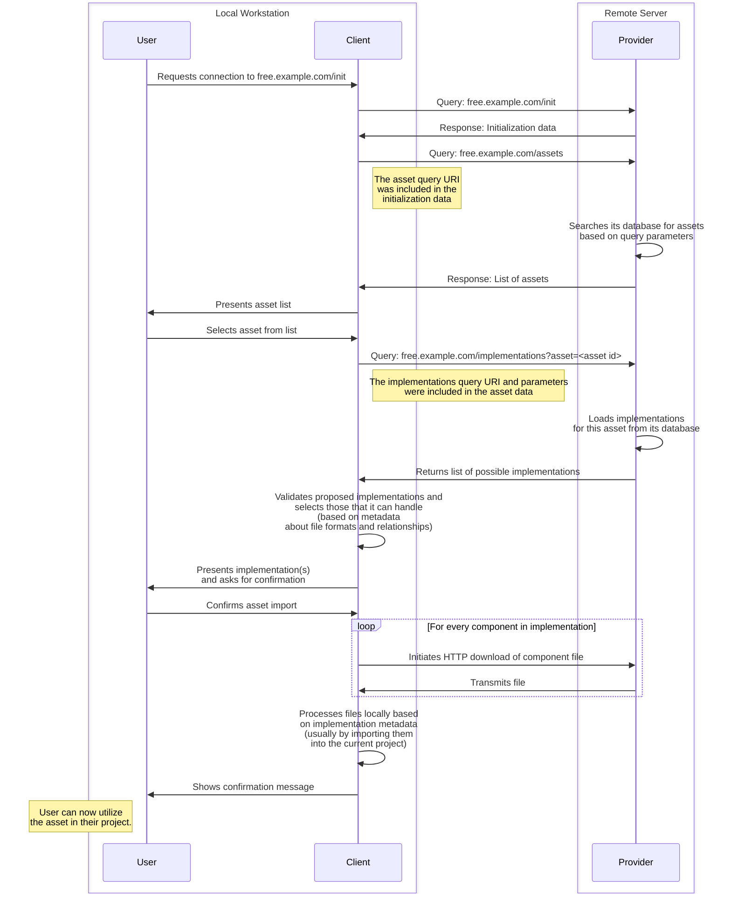
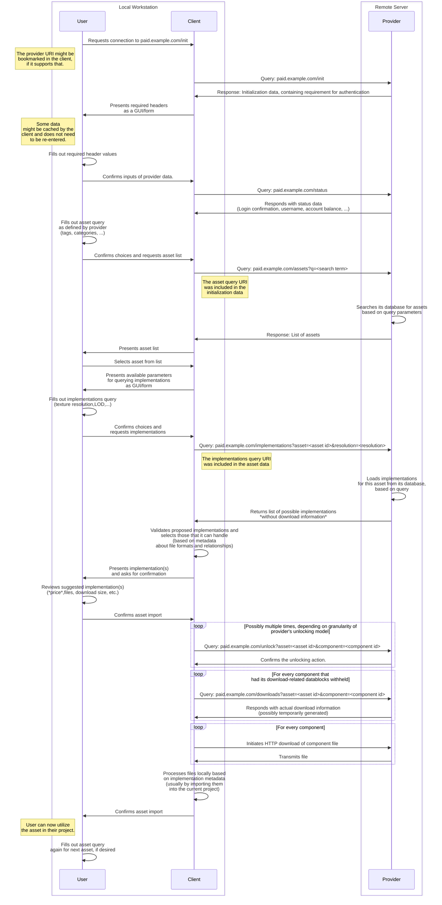

# AssetFetch Specification - Version 0.2

This document specifies **AssetFetch**, an HTTP- and JSON-based system for browsing, retrieving and handling/importing digital assets for media creation.
The AssetFetch Protocol aims to provide a standardized way for artists to browse libraries of downloadable assets offered by providers *outside* their current production environment/pipeline, such as those of commercial or non-profit 3D asset vendors, marketplaces or other repositories of models, textures or any other kind of digital assets.

# Motivation

Acquiring pre-made assets for use in a project usually involves visiting the website of a vendor offering 3D models, materials, and other resources and downloading one or multiple files to local storage.
These asset files are then manually imported into the desired application, a process which often involves additional manual steps for unpacking, file organization and adjustments after the initial import such as setting up a material from texture maps that came with a model file.

When trying to work with a large volume of third-party assets this workflow can become rather laborious, even more so when trying to experiment with multiple assets to see which works best in a scene.
Recognizing this issue, multiple vendors have started creating bespoke solutions that allow artists to browse an individual vendor's asset library in a much more integrated fashion, for example through an additional window or panel right in a 3D suite.
This vastly improves the user experience of browsing, downloading and importing assets and help artists to focus on their core creative objective.

However, these solutions, which are usually implemented using addons/plugins and are hard-coded to work with one 3D suite and one vendor, come with their own set of issues:

Vendors wanting to offer this improved user experience for their customers find themselves needing to build and maintain multiple pieces of software with limited opportunities for code reuse as every new plugin must be built within the language, framework and constraints presented by the target host application.

In light of this, many vendors to only offer a native integration for one or two applications or no native integrations at all because they don't have the resources and skills required or because development is not justifiable from a business perspective.

Conversely, large vendors who can afford to develop and continuously maintain native integrations for many different applications can benefit from a lock-in effect as only they can provide the convenience and speed that artists are accustomed to - limiting their choices.

**The AssetFetch system aims to help in creating an artist experience similar to the existing native integrations with less development overhead in order to increase interoperability between vendors and applications and allow more vendors - especially smaller ones - to offer their assets to artists right in the applications where they need them.**

## Goals

These are the goals of the AssetFetch specification:

- Describe a provider-independent way of enumerating, filtering and previewing assets.
- Facilitate the *one-time and one-directional transfer* of an asset with all its files from a provider to a client.
- Allow providers to describe the structure of their assets (i.e. how the files they provide should work together) in a way that allows for semi- or fully-automated handling on the client-side with the smallest amount of "fix-up" work that is achievable. 
<br><br>
- Work without additional coordination or custom code between the two parties.
- Make offering assets a low-threshold process for implementors on the provider side.
- Allow implementors on the client side (for whom the implementation is somewhat harder) to easily get to an MVP-stage and gradually build out their implementations from there.

## Non-Goals

In order to maintain focus and make the implementation achievable AssetFetch does not want to:

- Act as a full asset management system for project- or studio-internal use, i.e. one that permanently tracks potentially evolving assets within an ongoing production. AssetFetch shares some ideas and data structures from [OpenAssetIO](https://openassetio.org/) but is not meant as a competitor or replacement for it, rather as a supplementary system. It might even be possible to run AssetFetch on top of OpenAssetIO in future versions.
- Act as a new file format for describing complex 3D scenes in great detail. This is left to [OpenUSD](https://openusd.org) or [MaterialX](https://materialx.org/).

# Terminology

### User
>The human who uses AssetFetch client.

### Client
>A piece of software built to interact with the AssetFetch-API of a provider in order to download resources from a provider.

### Host application
>An application into which the client is integrated.

A client can be a standalone application but it more likely is integrated into another host application, like a 3D suite, in the form of a plugin/addon.
The crucial difference to existing provider-specific plugins/addons is that only one implementation needs to be developed and maintained per application, instead of one per provider-application pairing.
In reality there may of course still be multiple client plugins developed for the same application, but the choice for one of them should have less of an impact.

### Provider
>The place that offers assets by hosting an AssetFetch-compliant HTTP(S)-Endpoint.

This provider can be a commercial platform that is offering 3D assets for sale or an open repository providing content for free.

### Asset
>A reusable *logical* media element in the context of a digital project.

The emphasis is put on the term "logical" to indicate that one asset does not necessarily represent a single file as it might be composed of one or multiple meshes, textures, bones, particle systems, simulation data, etc. that are kept in multiple files.

- A model of a chair with its mesh and textures is considered one asset.
- An HDRI environment map is considered one asset.
- A character with textures and a rig is considered one asset.

### (Asset-)Implementation
> A concrete collection of components, almost always files, that represent the asset in exactly one way for a specific use case, potentially even just for one specific application.

When describing the transfer of assets from a provider to a client it is common for the provider to have the same asset available in many different quality levels (resolutions or LODs) and file formats for different applications.
Some vendors allow their users to control these parameters with great precision so that they only need to download the asset in exactly the format and quality that is desired.
This exact choice - or rather the collection of files with metadata that is a result of it - is considered the "implementation of an asset".

- An OBJ file containing the LOD1 mesh of a chair along with a set of TIFF texture maps measuring 512x512 pixels each is considered one implementation of the chair asset. Using the LOD0 version instead yields a new implementation of the same asset.
- An EXR image with a resolution of 8192x4096 pixels in an equirectangular projection is considered one implementation.
Tonemapping the EXR image into a JPG image yields a new implementation of the same asset.
- A BLEND file containing a character model, its rig and all its textures (again with a specific resolution) packed into it is considered one implementation.
A UASSET file containing the same character and the same texture resolution set up for Unreal Engine instead of Blender is considered a different implementation (of the same asset, since the logical element is still the same character).

### (Implementation-)Component
> A piece of digital information, almost always a file, that is part of an asset implementation.

- The roughness map of the aforementioned chair implementation is one component.
- The EXR file containing the panoramic environment is a component - The only component in the implementation of that environment.
- The BLEND file with the character model and textures packed into it is also considered one component since the BLEND file is a black box for any program except Blender.
- When working with archives, the archive itself as well as its contents are considered components.
A ZIP archive with the chair model as an FBX file and its textures as PNG files is represented as one component for the ZIP archive and one component for every file in it (with some exceptions when using specific unpacking configurations).

#### Active vs. Passive Components
Not all components of an implementation must be actively processed by the client in order to use them and are instead handled implicitly by the host application.
When a client instructs its host to load a component and this component causes multiple other components to be loaded (for example a mesh file referencing two textures) then the first component would be called "active" (because from the client's perspective it needed active handling) whereas the components referenced by it are called "passive" (because the AssetFetch client didn't need to handle them directly).

### Datablock
> A piece of metadata of a certain type and structure that can be attached to most other datastructures defined by AssetFetch.

Datablocks are extremely flexible and sometimes reusable pieces of metadata that enable the communication of specific attributes, instructions how to parse other data elsewhere, relationships, or how to properly interact with a provider's API in the first place.


# General Operation

This section describes the general mechanisms by which AssetFetch operates.

## Overview

These are the key steps that are necessary to successfully browse for and download an asset from a provider.

### Initialization
The client makes an initial connection to the provider by making a call to an initialization endpoint communicated by the provider to the user through external channels.
This initialization endpoint is freely accessible via HTTP GET and communicates key information for further usage of the provider's interface, such as:

- The name and other metadata about the provider itself.
- Whether the provider requires the client to authenticate itself through additional HTTP headers.
- The URI through which assets can be queried.
- What parameters can be used to query for assets.


### Authentication (optional)
The provider MAY require custom authentication headers, in which case the client MUST send these headers along with every request it performs to that provider, except for initialization.
The names of these headers, if any, MUST be declared by the provider during the initialization.
The client obtains the required header values, such as passwords or randomly generated access tokens, from the user through a GUI or from a cache or other storage location.
The implementation of this possible storage is not part of the specification and left up to the client implementor.

### Connection Status (optional)
If the provider uses authentication, then it MUST offer a connection status endpoint whose URI is communicated during initialization and which the client SHOULD contact at least once after initialization to verify the correctness of the headers entered by the user.

The connection status endpoint has two primary uses:

- The provider SHOULD respond with user-specific metadata, such as a username or other account details which the client MAY display to the user to verify to them that they are properly connected to the provider.
- If the provider wants to charge users for downloading assets using a prepaid balance system, then it SHOULD use this endpoint to communicate the user's remaining account balance.

After the initial call the client SHOULD call the connection status endpoint again after specific events to receive updated user data or account balance information.
Recommended times for calling the connection status endpoint will be mentioned later TODO.

### Browsing assets
After successful initialization (and possibly authentication) the user MAY (or depending on the requirements by the provider MUST) enter values for the asset search parameters which were defined by the provider during the initialization step.
Examples include keywords or a category selection.
The client then loads a list of available assets from the provider.
This list SHOULD includes general metadata about every asset, such as a name, a thumbnail image, license and other information.
It also MUST include information on how to query the provider for implementations of that asset.
The user chooses one of the assets they wish to receive.

### Choosing an implementation
In order to load an asset a specific implementation of that asset needs to be chosen.
The first step of this process involves receiving a list of possible implementations from the provider using the information on how to request it sent by the provider along with the other asset metadata.
The provider MAY request additional parameters for querying implementations in order to filter for asset-specific data like texture resolution, level of detail, etc.
The exact parameters are defined by the provider.
After getting the parameters from the user (if applicable) the client requests the list of available implementations for this asset. 
The provider responds with a list of possible implementations available for this asset and the quality parameters chosen by the user.
The implementations each consist of a list of components, each of which have metadata attached to them containing information about file formats, relationships and downloads.
The client analyzes the metadata declarations of each component in every proposed implementation in order to test it for compatibility.
If at least one implementation turns out to be compatible with the client and its host application, the process can proceed.
If more than one implementation is valid for the given client and its host application, it SHOULD ask the user to make the final choice.
This whole process is comparable to the rarely used [agent-driven content negotiation](https://developer.mozilla.org/en-US/docs/Web/HTTP/Content_negotiation#agent-driven_negotiation) in the HTTP standard.

### Unlocking (Optional)
The provider MAY allow any user to download any asset for free and without authentication or restrictions, but it MAY also require payment for an asset.
To accommodate this, providers are able to mark resources as "unlockable", requiring further deliberate action by the client and user to access the files associated with their components.
Unlocking works by linking individual components to an "unlocking request" (i.e. purchase).
This mapping can be 1-to-1 where every component has its own unlocking query (for example for a texturing website that charges users individually for every texture map they download) or 1-to-many where one unlocking query is unlocking many different components (for example on a 3D website where purchasing a model usually unlocks all available model files and textures at once).

When responding with the implementation list the provider MAY withhold certain datablocks related to downloading from the implementation's components.
If it does that, then it MUST instead provide a list of possible unlocking queries, the mapping between components and unlocking queries and queries to receive the previously withheld download information for every component after the unlocking has happened.

The client SHOULD then present the required unlocking queries (along with the accompanying charges to) to the user.
If the user agrees, the client first performs the unlocking query (or queries) and then queries the provider for the previously withheld datablocks which contain the real (possibly ephemeral) download links.
It should be noted that the AssetFetch does not handle the actual payment itself, users still need to perform any required account- and payment setup with the provider through external means, like the provider's website.

### Downloading and Handling
After choosing a suitable implementation and unlocking all of it's datablocks (if required), the client can download the files for every component of the implementation into a newly created dedicated directory on the local workstation on which the client is running.
The choice about where this directory should be created is made between the client and user through configuration and is not part of the specification.

Inside this directory the client SHOULD arrange the files as described by the provider in the implementation metadata to ensure that relative links between files remain intact.

At this point the client can - either by itself or through calls to its host application - handle the files that it obtained.
In the context of a 3D suite this usually involves importing the data into the current scene or a software-specific repository of local assets.
This processing is aided by the metadata in the datablocks of every component sent by the provider which describes relevant attributes, recommended vendor-specific configurations or relationships between files.

At this point the interaction is complete and the user MAY start a new query for assets.

## Sequence Diagram
The following diagrams illustrate the general flow of information between the user,[their client software](#client) and the provider as well as the most important actions taken by each party.

### Simple Version
This diagram shows a simple implementation without any ability for dynamic filtering or dynamically generated implementations and without requiring authentication or unlocking.
All assets are freely available for everyone.



### Complete Version

This diagram shows a more complete interaction, including authentication and asset unlocking.




# HTTP Communication

This section describes general instructions for all HTTP communication described in this specification.

## Request payloads

The payload of all HTTP requests from a client to a provider MUST be encoded as [`application/x-www-form-urlencoded`](https://url.spec.whatwg.org/#application/x-www-form-urlencoded), the same format that is used by standard HTML forms.

Examples for a valid query payload are shown below. 
```
q=wood,old&min_resolution=512
lod=0
query=&category=marble
```

This encoding for request data is already extremely widespread and can therefore usually be handled using standard libraries, both on the provider- and on the client-side.

## Response payloads

The payload of all HTTP responses from a provider MUST be valid [JSON](https://www.json.org/) and SHOULD use the `Content-Type` header `application/json`.
The exact structure of the data for individual endpoints and other API resources is specified in the [Endpoint section](#endpoint-list).

## User-Agent

The client SHOULD send an appropriate user-agent header as defined in [RFC 9110](https://www.rfc-editor.org/rfc/rfc9110#field.user-agent).

If the client is embedded in a host application, for example as an addon inside a 3D suite, it SHOULD set its first `product` and `product-version` identifier based on the "parent" application and then describe the product and version of the client plugin itself afterwards.

Examples for proper user-agents are:

```
cinema4d/2024.2 MyAssetFetchPlugin/1.2.3
3dsmax/2023u1 AssetFetchFor3dsMax/0.5.7
blender/4.0.3 BlenderAssetFetch/v17
standaloneAssetFetchClient/1.4.2.7
```

## Variable and Fixed Queries

In AssetFetch, there are several instances where the provider needs to describe a possible HTTP request that a client can make to perform a certain action or obtain data, such as browsing for assets, unlocking components or downloading files.
In this context, the specification differentiates between "variable" and "fixed" queries.

### Variable Query

A **variable query** is an HTTP(S) request defined by its URI, method and a payload _that has been (partly) configured by the user_ which is sent by the client to the provider in order to receive data in response.
For this purpose, the provider sends the client a list of parameters that it MAY (or MUST, depending on the configuration sent by the provider) use to construct the actual HTTP query to the provider.
For the client, handling a variable query usually involves drawing a GUI and asking the user to provide the values to be sent to the provider.

A simple example for a variable query is a query for listing assets that allows the user to specify a list of keywords before the request is sent to the provider.

#### Variable Query Parameters

A variable query is composed of its URI, HTTP method and one or multiple parameters.
The full field list of a variable query object can be found in the [`variable_query` datablock template](#variable_query).

If the provider decides to offer one or multiple adjustable parameters, it MUST choose one of the following parameter types for each parameter:

`text`: A plain text field, allowing for one line of arbitrary text. If the parameter is marked as mandatory, the client MUST respond with a non-empty string value for this parameter.
Otherwise, it MAY also respond with an empty string or omit this parameter from the query entirely.

`boolean`: A binary choice with no further labels for either state (apart from the title property), for example a tick-box.
When sending the request, the client MUST encode a `true` (ticked) choice with the parameter value `1`, and a `false` (unticked) choice with the value `0`.
If the parameter is marked as mandatory, the client MUST respond with one of these two choices.
Otherwise, it MAY omit this parameter from the query entirely.

`select`: A list of possible options, each represented by a string.
If the parameter is marked as mandatory, the client MUST ensure that the user has chosen exactly one option.
Otherwise the client MUST allow the user to pick one or none of the choices, in which case the client MAY omit the parameter from the query entirely.

`fixed`: A fixed value that the client MUST include in its request verbatim.
The client MAY show this value to the user, but MUST NOT allow any changes to this value.
Declaring this parameter mandatory or non-mandatory has no defined meaning.
Clients SHOULD ignore any such declarations by the provider.

### Fixed Query

A **fixed query** is an HTTP(S) request defined by its URI, method and a payload _that is not configurable by the user_  which is sent by the client to the provider in order to receive data in response.

In this case the provider only transmits the description of the query to the client whose only decision is whether or not to actually send the query with the given parameters to the provider.

A typical example for a fixed query is a download option for a file where the client only has the choice to invoke or not invoke the download.

The full field list of a fixed query object can be found in the [`fixed_query` datablock template](#fixed_query).

## HTTP Codes and Error Handling

Every response sent from an AssetFetch provider MUST use HTTP Status codes appropriately.

In concrete terms, this means:

- If a provider managed to successfully process the query then the response code SHOULD be `200 - OK`. Even if the query sent by the client leads to zero results in the context of a search with potentially zero to infinitely many results, the response code SHOULD still be `200 - OK`.
- If a provider receives a query that references a specific resource which does not exist, such as a query for implementations of an asset that the provider does not recognize, it SHOULD respond with code `404 - Not Found`.
- If the provider can not parse the query data sent by the client properly, it SHOULD respond with code `400 - Bad Request`.
- If a provider receives a query an any other endpoint than the initialization endpoint without one of the headers it defined as mandatory during the initialization it SHOULD send status code `401 - Unauthorized`. This indicates that the client is unaware of required headers and SHOULD cause the client to contact the initialization endpoint for that provider again in order to receive updated information about required headers.
- If a provider receives a query that does have all the requested headers, but the header's values could not be recognized or do not entail the required permissions to perform the requested query, it SHOULD respond with code `403 - Forbidden`. If the rejection of the request is specifically related to monetary requirements - such as the lack of a paid subscription, lack of sufficient account balance or the attempt to perform a download that has not been unlocked, the provider MAY respond with code `402 - Payment Required` instead.

If a client receives a response code that indicates an error on any query (`4XX`/`5XX`) it SHOULD pause its operation and display a message regarding this incident to the user.
This message SHOULD contain the contents of the `message` and `id` field in the response's [metadata](#the-meta-template), if they have content.


# About Endpoints

The interaction model described in the [General Operation](#general-operation) section principally implies that there are three kinds of HTTP(s)-based endpoints that a provider MUST implement:

- An initialization endpoint
- An endpoint for querying assets
- An endpoint for querying implementations of one specific asset

Depending on which features it wants to use, the provider MUST implement:
- A connection status endpoint if it wants to use custom headers for authentication
- An endpoint for unlocking resources and an endpoint for obtaining previously withheld datablocks if it wants to support asset unlocking (i.e. purchases).

The URI for the initialization endpoint is communicated by the provider to the user through external means (such as listing it on the provider's website).
The URIs and parameters for all subsequent endpoints are not defined explicitly by the specification and are communicated from the provider to the client.
This gives the provider great flexibility in how to structure its data and backend implementation.

### The `meta` template
All provider responses on all endpoints MUST carry the `meta` field to communicate key information about the current response.
### Structure
| Field | Format | Required | Description |
| --- | --- |--- | --- |
| `response_id` | string | no | An ID for this specific response from the provider. |
| `version` | string | yes | The version of AssetFetch that this response is intended for. |
| `kind` | string | yes | The kind of data that is being transmitted with this response. The exact value of this field is specified individually for each endpoint. |
| `message` | string | no | An arbitrary message to attach to this response. |

The `response_id` field is designed to aid with logging and troubleshooting, should the need arise.
The provider MAY set this field, in which case they SHOULD keep a log of the responses and their ids, especially in the case of an error.

If a request fails, the provider SHOULD use the `message` field to communicate more details for troubleshooting.

Clients SHOULD display the `response_id` and `message` fields to the user if a query was unsuccessful, as indicated by the HTTP status code.

### The `datablock_collection` template
This object contains most of the relevant information for any resource and always has the same general structure, described in this section.

| Field | Format | Required | Description |
| --- | --- | --- | --- |
| \<string-key\> | object or array | yes | Exact structure is defined in the [Datablocks section](#datablocks) |
| \<string-key\> | object or array | yes | Exact structure is defined in the [Datablocks section](#datablocks) |
| ... (arbitrary number of datablocks)

Every key of this data object is the identifier for the datablock stored in that key's field.

The example below illustrates an object called `data` whose structure follows the `datablock_collection` template with two datablocks (`block_type_1` and `block_type_2`) which have a varying structure.

```
{
    "data":{
        "block_type_1":{
            "example_key": "example_value"
        },
        "block_type_2.a":{
            "example_array": [1,2,4],
            "example_object": {
                "a": 7
            }
        }
    }
}
```

# Endpoint List

This section describes the required formats for the three core endpoint types which MUST be implemented by any provider.

## Initialization 

This endpoint is the first point of contact between a client and a provider.
The provider MUST NOT require any kind of authentication for interaction with it.
It's URI is initially typed or copy-pasted by the user into a client and is used to communicate key details about the provider as well as how the interaction between client and provider should proceed.

The response on this endpoint MUST have the following structure:

| Field | Format | Required | Description |
| --- | --- |--- | --- |
| `meta` | `meta` | yes | Metadata, kind: `initialization`. |
| `id` | `string` | yes | An id that identifies this provider. It MUST match the regular expression `[a-z0-9-\.]`. Providers SHOULD use a domain name (e.g. `example.com` or `sub.example.com`) as the ID, if applicable in their use-case. |
| `data` | `datablock_collection` | yes |  |

- The `data` field MUST always contain the datablock `asset_list_query`.
- The `data` field SHOULD always contain the datablock `text`.
- The `data` field MAY contain the datablocks `branding`, `authors`, `license`, and/or `web_references`.
- The `data` field MUST contain the datablock `headers` if other parts of the API require header-based authentication to function.

## Asset List

The URI and available parameters for this endpoint are communicated by the server to the client using the `asset_list_query` datablock on the initialization endpoint.

The response on this endpoint MUST have the following structure:

| Field | Format | Required | Description |
| --- | --- |--- | --- |
| `meta` | `meta` | yes| Metadata, kind: `asset_list`. |
| `data` | `datablock_collection` | yes |  |
| `assets` | array of `asset` | yes |  |

- The `data` field MAY contain the datablocks `next_query` and/or `response_statistics`.
- The `assets` field MUST NOT contain more than 100 entries for one response. If more assets than this are contained in the response, the `next_query` datablock SHOULD be used to define a new query that the client can use to fetch more results.

### `asset` Structure

Every `asset` object MUST have the following structure:

| Field | Format | Required | Description |
| --- | --- |--- | --- |
| `id` | string | yes | Unique id for this asset. Must match the regular expression `[a-z0-9_-]+` | 
| `data` | `datablock_collection` | yes |  |

- The `id` field MUST be unique among all assets for this provider. Clients MAY use this id when storing and organizing files on disk. Clients MAY use this field as a display title, but SHOULD prefer the `title` field in the asset's `text` datablock, if available.
- The `data` field MUST contain the datablock `implementation_list_query`.
- The `data` field SHOULD contain the datablocks `preview_image_thumbnail` and `text`.
- The `data` field MAY contain the datablocks `preview_image_supplemental`,`license`,`authors`,`dimensions.*`,`unlock` and/or `web_references`.

## Implementation List

This endpoint returns one or several implementations for one specific asset.
The URI and available parameters for this endpoint are communicated by the server to the client using the `implementation_list_query` datablock on the corresponding asset in the asset list endpoint.

| Field | Format | Required | Description |
| --- | --- |--- | --- |
| `meta` | `meta` | yes | Metadata, kind: `implementation_list`.|
| `data` | `datablock_collection` | yes | Datablocks that apply to the entire implementation list.  |
| `implementations` | yes | Array of `implementation` | |

- The `data` field MAY contain the datablocks `response_statics`

### `implementation` Structure

Every `implementation` object MUST have the following structure:

| Field | Format | Required | Description |
| --- | --- |--- | --- |
| `id` | string | yes | A unique id for this implementation. Must match the regular expression `[a-z0-9\._]+`.|
| `data` | `datablock_collection` | yes | Datablocks that apply to this specific implementation.|
| `components` | Array of `component` | yes |  |

- The `id` field MUST be unique among all possible implementations the provider offers for this asset, even if not all of them are included in the current implementation list.
- The `data` field SHOULD contain the datablock `text`.
- The `data` field MAY contain the datablock `unlock`.

### `component` Structure

Every `component` object MUST have the following structure:

| Field | Format | Required | Description|
| --- | --- |--- | --- |
| `id` | string | yes | A unique id for this component. Must match the regular expression `[a-z0-9\._]+`. |
| `data` | datablocks | yes | Datablocks.|

- The `id` field MUST be unique for among all components inside this component's implementation, but MAY be reused for a component in a different implementation.
- The `data` field on every `component` MUST contain the `file_info` datablock.
- The `data` field on every `component` MUST contain one of the `file_fetch.*` datablocks, unless it contains the `unlock` datablock.
- The `data` field on every `component` MAY contain any of the following datablocks: `environment_map`, `loose_material_define`, `loose_material_apply`, `mtlx_apply`,`text` and/or `unlock`.

# Additional Endpoints

Additional endpoint types can be used to perform certain actions or retrieve additional information.

Unless noted otherwise in the specification, these endpoints MUST use the following format:

| Field | Format | Required | Description|
| --- | --- |--- | --- |
| `meta` | `meta` | yes | Metadata, the endpoint kind is specified for every endpoint below. |
| `data` | `datablock_collection` | yes | Datablocks.|

## Unlocking Endpoint
*(kind: `unlock`)*

This endpoint type is used to "unlock" (usually meaning "purchase") an asset or asset component.
The client calls this endpoint in order to receive the `fixed_query` for downloading the .
The URI and parameters for this endpoint are communicated through the `unlock_query` field in an `unlock` datablock.

This endpoint currently does not use any datablocks specified for it. Only the HTTP status code and potentially the data in the `meta` field are used to evaluate the success of the request.

## Unlocked Datablocks Endpoint
*(kind:`unlocked_datablocks`)*

This endpoint type responds with the previously withheld datablocks for one component, assuming that the client has made all the necessary calls to the unlocking endpoint.
It gets called by the client for every component that had an `unlockable_data_query` datablock assigned to it.


- The `data` field contains all the datablocks that are only available for the component after it has been unlocked. 
This field is open to extension, but currently the provider MUST NOT include any other datablock than `file_fetch.download` in this list.

## Connection Status Endpoint
*(kind: `connection_status`)*

The URI and parameters for the balance endpoint are communicated by the provider to the client through the `provider_configuration` datablock.

- The `data` field for this endpoint SHOULD contain the `unlock_balance` datablock, if asset unlocking is used.
- The `data` field for this endpoint MAY contain the `user` datablock.


# Datablocks

## Datablock names

The name of a datablock MUST be a string composed of small alphanumerical characters, underscores and dots .
Datablock names MUST contain either 0 or 1 instance of the dot (`.`) character which indicates that a datablock has multiple variations.
One resource MUST NOT have two datablocks that share the same string *before* the dot separator.

The resulting regular expression from these rules is `^[a-z0-9_]+(\.[a-z0-9_]+)?$`.

## Datablock value templates
This section describes additional data types that can be used within other datablocks.
They exist to eliminate the need to re-specify the same data structure in two different places.
The templates can not be used directly as datablocks under their template name.

### `variable_query`
This template describes an HTTP query whose parameters are controllable by the user.
See [Variable and Fixed Queries](#variable-and-fixed-queries) for more details.

| Field | Format | Required | Description |
| --- | --- |--- | --- |
| `uri` | string | yes| The URI to send the request to. |
| `method` | string | yes| One of `get`, `post` |
| `parameters` | array of `parameter` | yes| The configurable parameters for this query. |

#### `parameter` Structure
A parameter describes the attributes of one parameter for the query and how the client can present this to its user.

| Field | Format | Required | Description |
| --- | --- |--- | --- |
| `type` | string | yes | One of `text` / `boolean`  / `select` / `fixed` |
| `id` | string | yes | The id of the HTTP parameter. It MUST be unique among the parameters of one variable query. The client MUST use this value as a the key if it is sending a response using this parameter. |
| `title` | string | no | Title to display to the user. |
| `default` | string | no | The default value for this parameter. It becomes the only possible value for this parameter if type `fixed` is used. |
| `mandatory` | boolean | no, default=`false` | This field describes whether a parameter is mandatory (see below). |
| `choices` | array of `choice` | only if `select` type is used | This field contains the possible choices when the `select` type is used. |

#### `choice` Structure
| Field | Format | Required | Description |
| --- | --- |--- | --- |
| `value` | string | yes | The value that the client MUST use in its HTTP response if the user has selected this choice. |
| `title` | string | yes | The title that the client SHOULD display to the user to represent this choice. |


### `fixed_query`
This template describes a fixed query that can be sent by the client to the provider without additional user input or configuration.
See [Variable and Fixed Queries](#variable-and-fixed-queries) for more details.

| Field | Format | Required | Description |
| --- | --- |--- | --- |
| `uri` | string | yes | The URI to contact for getting more results. |
| `method` | string | yes | MUST be one of `get` or `post` |
| `payload` | object with string properties | no  | The keys and values for the payload of the request.  |


# Datablock Index

This section displays all datablocks that are currently part of the standard.

The text in brackets before the title indicates which kind of AssetFetch resources this block can be applied to.
To aid with reading this list, exclamation marks and question marks are used to indicate whether this datablock MUST be applied to that resource (!) or if it SHOULD/MAY (?) be applied.
A star (*) is used to indicate that there are special rules for when/if this datablock is to be used.

## Browsing-related datablocks

These datablocks all relate to the process of browsing for assets or implementations.

### [Init!] `asset_list_query`
Describes the variable query for fetching the list of available assets from a provider.
Follows the `variable_query` template.

### [Asset!] `implementation_list_query`
Describes the variable query for fetching the list of available implementations for an asset from a provider.
Follows the `variable_query` template.

### [AssetList?/ImplementationList?] `next_query`

Describes a fixed query to fetch more results using the same parameters as the current query.
Follows the `fixed_query` template.

### [AssetList?/ImplementationList?] `response_statistics`

| Field | Format | Required | Description |
| --- | --- |--- | --- |
| `result_count_total` | int | yes | The total number of results. This number should include the total number of results matching the given query, even if not all results are returned due to pagination using the `query_next` datablock. | 


## Configuration and authentication-related datablocks

### [Init!*] `provider_configuration`
Headers that the provider expects to receive from the client on every subsequent request.

This datablock has the following structure:

| Field | Format | Required | Description |
| --- | --- | --- | --- |
| `headers` | Array of `header` | yes | List of headers that the client MAY or MUST (depending on configuration) send to the provider on any request. |
| `connection_status_query` | `fixed_query` | yes | Query to use for checking whether the provided headers are valid und for obtaining connection status information. |
| `header_acquisition_uri` | string | no | A URI that the client MAY offer to open in the user's web browser to help them obtain the header values. |
| `header_acquisition_uri_title` | string | no | Title for the `acquisition_uri`. |


#### `header` structure

| Field | Format | Required | Description |
| --- | --- |--- | --- |
| `name` | string | yes | Name of the header |
| `default` | string | no | Default value as a suggestion to the client |
| `is_required` | boolean | yes | Indicates if this header is required.|
| `is_sensitive` | boolean | yes | Indicates if this header is sensitive and instructs the client to take appropriate measures to protect it. See [Storing Sensitive Headers](#storing-sensitive-headers) |
| `prefix` | string | no | Prefix that the client should prepend to the value entered by the user when sending it to the provider. The prefix MUST match the regular expression `[a-zA-Z0-9-_\. ]*`. |
| `suffix` | string | no | Suffix that the client should append to the value entered by the user when sending it to the provider.The suffix MUST match the regular expression `[a-zA-Z0-9-_\. ]*`. |
| `title` | string | no | Title to display inside the client |
| `encoding` | string | no, default=`plain` | The encoding that the client MUST apply to the header value. MUST be one of `plain` or `base64`. | 

### [Status?] `provider_reconfiguration`

This datablock allows the provider to communicate to the client a new set of headers that it MUST sent along with every request instead of those entered by the user until a new initialization is performed (possibly,though not necessarily,using new header values entered by the user).
The client MUST fully replace the values defined using the requirements from the `provider_configuration` datablock with the new values defined in this datablock.

These new headers effectively act like cookies used on web sites.
Providers SHOULD only use this datablock for purposes that are strictly required for the communication to work and MUST consider the potential legal implications when deciding to use this datablock for other purposes such as tracking or analytics.

Clients MAY require the user to confirm the new header values before starting to send them.

| Field | Format | Required | Description |
| --- | --- | --- | --- |
| `headers` | Object | yes | An object whose properties MUST all be strings. The keys indicate the new header names, the property values represent the new header values to be used. |


### [Status?] `user`

This datablock allows the provider to transmit information about the user to the client, usually to allow the client to show the data to the user for confirmation that they are properly connected to the provider.

| Field | Format | Required | Description |
| --- | --- | --- | --- |
| `display_name` | string | no | The name of the user to display. |
| `display_tier` | string | no | The name of the plan/tier/subscription/etc. that this user is part of, if applicable for the provider.|
| `display_icon_uri` | string | no | URI to an image with an aspect ratio of 1:1, for example a profile picture. |

## File-related datablocks

### [Component!] `file_info`

This datablock contains information about a file.

| Filed | Format | Required | Description |
| --- | --- | --- | --- |
| `local_path` | string | yes, unless `behavior=archive` | The sub-path that this file should take in the directory of this implementation. |
| `length` | integer | no | The length of the file in bytes. |
| `extension` | string | yes | The file extension indicating the format of this file. |
| `behavior` | string | yes | One of `file_active`,`file_passive`,`archive` |

The `extension` MUST include a leading dot (`.obj` would be correct,`obj` would not be correct), and can include multiple dots required for properly expressing the format (eg. `.tar.gz` for a gzipped tar-archive).

The `behavior` describes whether this file should be treated as an [active or passive file component](#active-vs-passive-components) or as an archive.

If `behavior=archive` and the `local_path` is not `null`, the entire archive MUST be unpacked into the local path.

If `behavior=archive` and the `local_path` *is* `null`, the archive MUST NOT be unpacked in full automatically. Instead, other components can reference data from this archive using the `file_fetch.from_archive` datablock.
The client MAY unpack the entire archive into a temporary directory if it helps with processing the `file_fetch.from_archive` datablocks of other components.

#### `local_path` rules

##### `behavior=file_*`

If `behavior=file_active` or `behavior=file_passive` then the `local_path` MUST include the full name that the file should take in the destination and it MUST NOT start with a "leading slash".

The `local_path` MUST NOT contain relative path references (`./` or `../`) anywhere within it.

`example.txt` or `sub/dir/example.txt` would be correct, `/example.txt`, `./example.txt` or `/sub/dir/example.txt` would be incorrect.

##### `behavior=archive`

In that case the local path MUST end with a slash ("trailing slash") and MUST NOT start with a slash (unless it targets the root of the asset directory in which case the `local_path` is simply `/`).

The `local_path` MUST NOT contain relative path references (`./` or `../`) anywhere within it.

`contents/` or `my/contents/` would be correct, `contents`,`./contents/`,`./contents`,`my/../../contents` or `../contents` would all be incorrect.

### [Component!*] `file_fetch.download`

This datablock indicates that this is a file which can be downloaded directly using the provided query.
The download destination is defined via the `file_info` datablock.

The structure of this datablock follows the `fixed_query` template.
### [Component!*] `file_fetch.from_archive`
This datablock indicates that this component represents a file from within an archive that needs to be downloaded separately.
More about the handling in [Component Handling](#component-handling).
The destination is defined via the `file_info` datablock.

| Field | Format | Required | Description |
| --- | --- |--- | --- |
| `archive_component_id` | string | yes | The id of the component representing the archive that this component is contained in. |
| `component_path` | string | The location of the file inside the referenced archive. This MUST be the path to the file starting at the root of its archive. It MUST NOT start with a leading slash and MUST include the full name of the file inside the archive. It MUST NOT contain relative path references (`./` or `../`).  |

## Display related datablocks

These datablocks relate to how assets and their details are displayed to the user.

### [Init?/Asset?/Implementation?/Component?] `text`
General text information to be displayed to the user.

| Field | Format | Required | Description |
| --- | --- |--- | --- |
| `title` | string | yes | A title for the datablock's subject. |
| `description` | string | no | A description text for the datablocks subject. |


### [Init?/Asset?] `web_references`
References to external websites for documentation or support.

An array of objects each of which MUST follow this format:
| Field | Format | Required | Description |
| --- | --- |--- | --- |
| `title` | string | yes | The title to display for this web reference. |
| `uri` | string | yes | The URL to be opened in the users browser. |
| `icon_uri` | string | yes | URL to an image accessible via HTTP GET. The image's media type SHOULD be one of `image/png` or `image/jpeg`. |

### [Init?] `branding`
Brand information about the provider.

| Field | Format | Required | Description |
| --- | --- |--- | --- |
| `color_accent` | string | no | Color for the provider, hex string in the format 'abcdef' (no #)
| `logo_square_uri` | string | no | URI to a square logo. It SHOULD be of the mediatype `image/png` and SHOULD be transparent.|
| `logo_wide_uri` | string | no | URI to an image with an aspect ratio between 2:1 and 4:1. SHOULD be `image/png`, it SHOULD be transparent.
| `banner_uri` | string | no | URI to an image with an aspect ratio between 2:1 and 4:1. SHOULD be `image/png` or `image/jpg`. It SHOULD NOT be transparent.|

### [Init?/Asset?] `license`
Contains license information.
When attached to an asset, it means that the license information only applies to that asset, when applied to a provider, it means that the license information applies to all assets offered through that provider.

| Field | Format | Required | Description |
| --- | --- | --- | --- |
| `license_spdx` | string | no | MUST be an [SPDX license identifier](https://spdx.org/licenses/) or be left unset/null if not applicable. |
| `license_uri` | string | no | URI which the client SHOULD offer to open in the user's web browser to learn more about the license. |

### [Asset?] `authors`

This datablock can be used to communicate the author(s) of a particular asset.

Array of objects that MUST have this structure:

| Field | Format | Required | Description
| --- | --- |--- | --- |
| `name` | string | yes | Name of the author. |
| `uri` | string | no | A URI for this author, for example a profile link. |
| `role` | string | no | The role that the author has had in the creation of this asset. |

### [Asset?] `dimensions.3d`
Contains general information about the physical dimensions of a three-dimensional asset. Primarily intended as metadata to be displayed to users, but MAY also be used by the client to scale mesh data.

An object that MUST conform to this format:
| Field | Format | Required | Description |
| --- | --- |--- | --- |
| `width_m` | float | yes | Width of the referenced asset |
| `height_m` | float | yes | Height of the referenced asset |
| `depth_m` | float | yes | Depth of the referenced asset |

### [Asset?] `dimensions.2d`
Contains general information about the physical dimensions of a two-dimensional asset. Primarily intended as metadata to be displayed to users, but MAY also be used by the client to scale mesh-,texture-, or uv data.

An object that MUST conform to this format:
| Field | Format | Required | Description |
| --- | --- |--- | --- |
| `width_m` | float | yes | Width of the referenced asset |
| `height_m` | float | yes | Height of the referenced asset |

### [Asset?] `preview_image_supplemental`
Contains a list of preview images with `uri`s and `alt`-Strings associated to the asset.

An array where every field must conform to the following structure:
| Field | Format | Required | Description |
| --- | --- |--- | --- |
| `alt` | string | no | An "alt" String for the image. |
| `uri` | string | yes | URL to an image accessible via HTTP GET. The image's media type SHOULD be one of `image/png` or `image/jpeg`.

### [Asset?] `preview_image_thumbnail`
Contains information about a thumbnail for an asset. The thumbnail can be provided in multiple resolutions.

An object that MUST conform to this format:
| Field | Format | Required | Description |
| --- | --- |--- | --- |
| `alt` | string | no | An "alt" String for the image. |
| `uris` | object | yes | See structure described below. |

#### `uris` Structure

The `uris` field MUST be an object whose keys are strings containing an integer and whose values are strings.
The object MUST have at least one member.
The key represents the resolution of the thumbnail, the value represents the URI for the thumbnail image in this resolution.
The thumbnail image SHOULD be a square.
If the image is not a square, its key SHOULD be set based on the pixel count of its longest site.
The image's media type SHOULD be one of `image/png` or `image/jpeg`.
If the provider does not have insight into the dimensions of the thumbnail that it is referring the client to, it SHOULD use use the key `0` for the thumbnail url.

## File handling and relationship datablocks

These datablocks describe how files relate to each other.
In many cases the relationships can be represented purely by placing component files adjacently in one directory and making only some of them "active", but in some cases it is necessary to declare relationships explicitly in AssetFetch.

### [Component?] `loose_environment`
The presence of this datablock on a component indicates that it is an environment map.
This datablock only needs to be applied if the component is a "bare file", like (HDR or EXR), not if the environment is already wrapped in another format with native support.
An object that MUST conform to this format:
| Field | Format | Required | Description |
| --- | --- |--- | --- |
| `projection` | string | yes | One of `equirectangular`, `mirror_ball` |

### [Component?] `loose_material_define`

| Field | Format | Required | Description |
| --- | --- |--- | --- |
| `material_name` | string | yes | |
| `map` | string | yes | `albedo` `roughness` `metallic` `diffuse` `glossiness` `specular` `height` `normal+y` `normal-y` `opacity` `ambient_occlusion` `emission`|
| `colorspace` | string | no | One of `srgb`, `linear` |

### [Component?] `loose_material_apply`
When applied to a component, it indicates that this component uses one or multiple materials defined using `loose_material_define` datablocks.
Array of objects with this structure:

| Field | Format | Required | Description |
| --- | --- |--- | --- |
| `material_name` | string | yes | Name of the material used in the definition datablocks |
| `apply_selectively_to` | string | no | Indicates that the material should only be applied to a part of this component, for example one of multiple objects in a `.obj` file. |

### [Component?] `mtlx_apply`
When applied to a component, it indicates that this component makes use of a material defined in mtlx document represented by another component.

| Field | Format | Required | Description |
| --- | --- |--- | --- |
| `mtlx_component_id` | string | yes | Id of the component that represents the mtlx file. | 
| `mtlx_material` | string | no | Optional reference for which material to use from the mtlx file, if it contains multiple. |
| `apply_selectively_to` | string | no |  Indicates that the material should only be applied to a part of this component, for example one of multiple objects in a `.obj` file. |

## File-format specific datablocks

### [Component?] `format.blend`
Information about files with the extension `.blend`.
This information is intended to help the client understand the file.

| Field | Format | Required | Description |
| --- | --- |--- | --- |
| `version` | string | no | Blender Version in the format `Major.Minor.Patch` or `Major.Minor` or `Major` |
| `is_asset` | boolean | no | `true` if the blend file contains object(s) marked as an asset for Blender's own Asset Manager. (default=`false`) |
| `targets` | array of `target` | no | Array containing the blender structures inside the file that are relevant to the asset. |

#### `target` Structure

| Field | Format | Required | Description |
| --- | --- |--- | --- |
| `kind` | `string` | yes | One of `actions`, `armatures`, `brushes`, `cache_files`, `cameras`, `collections`, `curves`, `fonts`, `grease_pencils`, `hair_curves`, `images`, `lattices`, `lightprobes`, `lights`, `linestyles`, `masks`, `materials`, `meshes`, `metaballs`, `movieclips`, `node_groups`, `objects`, `paint_curves`, `palettes`, `particles`, `pointclouds`, `scenes`, `screens`, `simulations`, `sounds`, `speakers`, `texts`, `textures`, `volumes`, `workspaces`, `worlds` |
| `names` | Array of `string` | yes | List of the names of the resources to import. |

### [Component?] `format.usd`
Information about files with the extension `.usd`.

| Field | Format | Required | Description |
| --- | --- |--- | --- |
| `is_crate` | boolean | no | Indicates whether this file is a "crate" (like .usdc) or not (like .usda).|

### [Component?] `format.obj`
Information about files with the extension `.obj`.

| Field | Format | Required | Description |
| --- | --- |--- | --- |
| `up_axis` | string | yes | Indicates which axis should be treated as up. MUST be `+y` or `+z` |
| `use_mtl` | boolean | yes | Indicates whether the client should attempt to read material data from the MTL files referenced inside the obj-file. |


## Unlocking-related datablocks

These datablocks are used if the provider is utilizing the asset unlocking system in AssetFetch.

### [Status?] `unlock_balance`
Information about the user's current account balance.

| Field | Format | Required | Description | 
| --- | --- |--- | --- |
| `balance` | number | yes | Balance.|
| `balance_unit` | string | yes | The currency or name of token that's used by this provider to be displayed alongside the price of anything. |
| `balance_refill_uri` | string | yes | URL to direct the user to in order to refill their prepaid balance, for example an online purchase form. |

### [Component?] `unlock_link`

This datablock links the component to one of the unlocking queries defined in the `unlock_queries` datablock on the implementation list.

| Field | Format | Required | Description |
| --- | --- |--- | --- |
| `unlock_query_id` | string | yes | The id of the unlocking query in the `unlock_queries` datablock. This indicates that the query defined there MUST be run before attempting to obtain the remaining datablocks (with the download information) using the `unlocked_datablocks_query`. |
| `unlocked_datablocks_query` | `fixed_query` | yes | The query to fetch the datablocks for this component if the unlocking was successful. |

### [ImplementationList?] `unlock_queries`

This datablock contains the query or queries required to unlock all or some of the components in this implementation list.

This datablock is an `array` consisting of `unlock_query` objects.

#### `unlock_query` structure

| Field | Format | Required | Description |
| --- | --- |--- | --- |
| `id` | string | yes | This is the id by which `unlock_link` datablocks will reference this query. |
| `unlocked` | boolean | yes | Indicates whether the subject of this datablock is already unlocked (because the user has already made this query and the associated purchase in the past ) or still locked. |
| `price` | number | only if `unlocked=False` | The price that the provider will charge the user in the background if they run the `unlock_query`. This price is assumed to be in the currency/unit defined in the `unlock_balance` datablock. |
| `unlock_query` | `fixed_query` | only if `unlocked=False` | Query to perform to to make the purchase. |
| `unlock_query_fallback_uri` | string | no | An optional URI that the client MAY instead open in the user's web browser in order to let them make the purchase manually. |


# Component Handling

After the client chooses a final implementation for which it is confident that it will be able to handle all components based on the contents of their datablocks, the client can then perform all the required downloads downloads and then process the components.

## Handling Active and Passive Components
When processing the components of an implementation, the `behavior` datablock decides what kind of actions the client should take on it.

If the behavior is `active`, then the client SHOULD make an attempt to load this file directly, for example through the host application's native import functionality.

If the behavior is `passive`, then the client SHOULD NOT make a direct attempt to load this file and only load it if it is referenced by another (active) component, either through a native reference in the component file itself or through a reference in the AssetFetch data (like `loose_material_apply`).

## Local Storage of Asset Files
As described in the previous section, individual asset components/files may have implicit relationships to each other that are not directly visible from any of the datablocks such as relative file paths within project files.
To ensure that these references are still functional, AssetFetch specifies certain rules regarding how clients arrange downloaded files in the local file system.

A client SHOULD create a dedicated directory for every implementation of every asset that it downloads.
The location of this directory is not specified and can be fixed for all uses of the client. It can also be dependent on the context in which the client currently runs, for example a subfolder relative to the open project in a 3D suite.
Inside this directory it SHOULD place every file as specified in the `local_path` field of the component's `datablock`.
When opening any downloaded file it SHOULD happen from this directory to ensure that relative file paths continue to work.

## Materials

### Using native formats and hidden components
Many file formats for 3D content - both vendor-specific as well as open - offer native support for referencing external texture files.
Providers SHOULD use these "native" references whenever possible.
When materials are used alongside a 3D model file with proper support, the material map components SHOULD be marked as passive.

#### MTLX
The `mtlx.apply_material` datablock allows references from a mesh component to an mtlx component.
This allows the use of `.mtlx` files with mesh file formats that do not have the native ability to reference MTLX files.

### Using loose material declarations
The workflow outlined in the previous section is not always easily achievable since not all file 3D file formats offer up-to-date (or any) support for defining materials.
In those cases it is common practice to simply distribute the necessary material maps along with the mesh files without any concrete machine-readable description for how the maps should be applied
The `loose_material_*` datablocks exist to limit the negative impacts of this limitation. They make it possible to define basic PBR materials through datablocks on the individual map components and reference them on the mesh component.

Providers SHOULD make use of this notation if, and only if, other more native representations of the material are unavailable of severely insufficient.

## Environments
HDRI environments or skyboxes face a similar situation as materials: They can be represented using native formats, but a common practice is to provide them as a singular image file whose projection must be manually set by the artist.
The `loose_environment` datablock works similar to the `loose_material` block and allows the provider to communicate that a component should be treated as an environment and what projection should be used.


# Security Considerations

This section describes security considerations for implementing AssetFetch.

## Storing sensitive headers
During the initialization step providers can mark headers as sensitive.
Clients MUST find an appropriate solution for storing these sensitive headers.
They SHOULD consider storing secret headers through native operation system APIs for credential management.

## Avoiding Relative Paths in `local_path`
Datablocks of the `fetch.*` family specify a local sub-path for every component that needs to be appended to a local path chosen by the client in order to assemble the correct file structure for this asset.
As specified in the [datablock requirements](#local_path-rules) the `local_path` MUST NOT contain relative references, especially back-references (`..`) as they can allow the provider to place files anywhere on the user's system ( Using a path like`"local_path":"../../../../example.txt"`).
Clients MUST take cate to ensure that components with references like `./` or `../` in their local path are rejected.