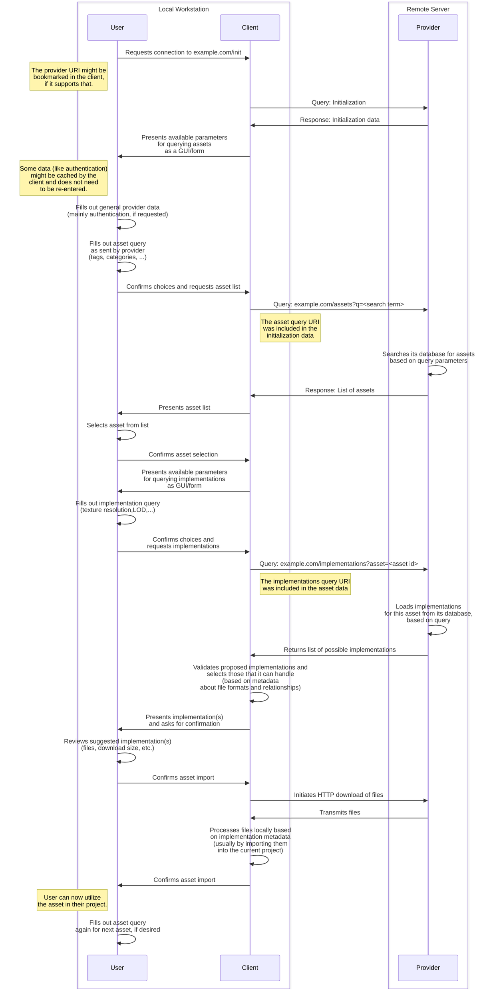

# AssetFetch Specification - Draft Version 0.1

This document specifies **AssetFetch**, an HTTP- and JSON-based system for browsing, retrieving and handling/importing digital assets for media creation.
The AssetFetch Protocol aims to provide a standardized way for artists to browse libraries of downloadable assets offered by providers *outside* their current production environment/pipeline, such as those of commercial or non-profit 3D asset vendors, marketplaces or other repositories of models, textures or any other kind of digital assets.

# Motivation

Acquiring pre-made assets for use in a project usually involves visiting the website of a vendor offering 3D models, materials, and other resources and downloading one or multiple files to local storage.
These asset files are then manually imported into the desired application, a process which often involves additional manual steps for unpacking, file organization and adjustments after the initial import such as setting up a material from texture maps that came with a model file.

When trying to work with a large volume of third-party assets this workflow can become rather laborious, even more so when trying to experiment with multiple assets to see which works best in a scene.
Recognizing this issue, multiple vendors have started creating bespoke solutions that allow artists to browse an individual vendor's asset library in a much more integrated fashion, for example through an additional window or panel right in a 3D suite.
This vastly improves the user experience of browsing, downloading and importing assets and help artists to focus on their core creative objective.

However, these solutions, which are usually implemented using addons/plugins and are hard-coded to work with one 3D suite and one vendor, come with their own set of issues:

Vendors wanting to offer this improved user experience for their customers find themselves needing to build and maintain multiple pieces of software with limited opportunities for code reuse as every new plugin must be built within the language, framework and constraints presented by the target host application.

In light of this, many vendors to only offer a native integration for one or two applications or no native integrations at all because they don't have the resources and skills required or because development is not justifiable from a business perspective.

Conversely, large vendors who can afford to develop and continuously maintain native integrations for many different applications can benefit from a lock-in effect as only they can provide the convenience and speed that artists are accustomed to - limiting their choices.

**The AssetFetch system aims to help in creating an artist experience similar to the existing native integrations with less development overhead in order to increase interoperability between vendors and applications and allow more vendors - especially smaller ones - to offer their assets to artists right in the applications where they need them.**

## Goals

These are the goals of the AssetFetch specification:

- Describe a provider-independent way of enumerating, filtering and previewing assets.
- Facilitate the *one-time and one-directional transfer* of an asset with all its files from a provider to a client.
- Allow providers to describe the structure of their assets (i.e. how the files they provide should work together) in a way that allows for semi- or fully-automated handling on the client-side with the smallest amount of "fix-up" work that is achievable. 
<br><br>
- Work without additional coordination or custom code between the two parties.
- Make offering assets a low-threshold process for implementors on the provider side.
- Allow implementors on the client side (for whom the implementation is somewhat harder) to easily get to an MVP-stage and gradually build out their implementations from there.

## Non-Goals

In order to maintain focus and make the implementation achievable AssetFetch does not want to:

- Act as a full asset management system for project- or studio-internal use, i.e. one that permanently tracks potentially evolving assets within an ongoing production. AssetFetch shares some ideas and data structures from [OpenAssetIO](https://openassetio.org/) but is not meant as a competitor or replacement for it, rather as a supplementary system. It might even be possible to run AssetFetch on top of OpenAssetIO in future versions.
- Act as a new file format for describing complex 3D scenes in great detail. This is left to [OpenUSD](https://openusd.org) or [MaterialX](https://materialx.org/).

# Terminology

### User
>The human who uses AssetFetch client.

### Client
>A piece of software built to interact with the AssetFetch-API of a provider in order to download resources from a provider.

### Host application
>An application into which the client is integrated.

A client can be a standalone application but it more likely is integrated into another host application, like a 3D suite, in the form of a plugin/addon.
The crucial difference to existing provider-specific plugins/addons is that only one implementation needs to be developed and maintained per application, instead of one per provider-application pairing.
In reality there may of course still be multiple client plugins developed for the same application, but the choice for one of them should have less of an impact.

### Provider
>The place that offers assets by hosting an AssetFetch-complient HTTP(S)-Endpoint.

This provider may be a commercial platform that is offering 3D assets for sale or an open repository providing content for free.

### Asset
>A reusable *logical* media element in the context of a digital project.

The emphasis is put on the term "logical" to indicate that one asset does not necessarily represent a single file as it might be composed of one or multiple meshes, textures, bones, particle systems, simulation data, etc. that are kept in multiple files.

- A model of a chair with its mesh and textures is considered one asset.
- An HDRI environment map is considered one asset.
- A character with textures and a rig is considered one asset.

### (Asset-)Implementation
> A concrete collection of components, almost always files, that represent the asset in exactly one way for a specific use case, potentially even just for one specific application.

When describing the transfer of assets from a provider to a client it is common for the provider to have the same asset available in many different quality levels (resolutions or LODs) and file formats for different applications.
Some vendors allow their users to control these parameters with great precision so that they only need to download the asset in exactly the format and quality that is desired.
This exact choice - or rather the collection of files that is a result of it - is considered the "implementation of an asset".

- An OBJ file containing the LOD1 mesh of a chair along with a set of TIFF texture maps measuring 512x512 pixels each is considered one implementation of the chair asset. Using the LOD0 version instead yields a new implementation of the same asset.
- An EXR image with a resolution of 8192x4096 pixels in an equirectangular projection is considered one implementation.
Tonemapping the EXR image into a JPG image yields a new implementation of the same asset.
- A BLEND file containing a character model, its rig and all its textures (again with a specific resolution) packed into it is considered one implementation.
A UASSET file containing the same character and the same texture resolution set up for Unreal Engine instead of Blender is considered a different implementation (of the same asset, since the logical element is still the same character).

### (Implementation-)Component
> A piece of digital information, almost always a file, that is part of an asset implementation.

- The roughness map of the aforementioned chair implementation is one component.
- The EXR file containing the panoramic environment is a component - The only component in the implementation of that environment.
- The BLEND file with the character model and textures packed into it is also considered one component since the BLEND file is a black box for any program except Blender.
- When working with archives, the archive itself as well as its contents are considered components.
A ZIP archive with the chair model as an FBX file and its textures as PNG files is represented as one component for the ZIP archive and one component for every file in it (with some exceptions when using specific unpacking configurations).

#### Active vs. Passive Components
Not all components of an implementation must be actively processed by the client in order to use them and are instead handled implicitly by the host application.
When a client instructs its host to load a component and this component causes multiple other components to be loaded (for example a mesh file referencing two textures) then the first component would be called "active" (because from the client's perspective it needed active handling) whereas the components referenced by it are called "passive" (because the AssetFetch client didn't need to handle them directly).

### Datablock
> A piece of metadata of a certain type and structure that can be attached to most other datastructures defined by AssetFetch.

Datablocks are extremely flexible and sometimes reusable pieces of metadata that enable the communication of specific attributes, relationships, or even higher-level information like how to properly interact with a provider.

- Which axis in an OBJ file should be used as the up-axis in contained in a datablock (See [`obj`](#component-obj)).
- The fact that a specific image belongs to a specific material and should be treated as a roughness map is contained in a datablock (See [the material section](#materials)).
- The fact that a specific EXR file should be treated as an HDRI environment map with equirectangular projection is contained in a datablock (See [the environments section](#environments)).
- The fact that a provider wants the client to send an HTTP header containing an access token is contained in a datablock (See [Authentication Using Headers](#authentication-using-headers)).
- The URL to a thumbnail image for an asset is communicated using a datablock (See [`preview_image.thumbnail`](#asset-preview_imagethumbnail))

### Variable Query
> An HTTP(S) request defined by its URI, method and a payload _that has been (partly) configured by the user_ which is sent by the client to the provider in order to receive data in response.

- A user searching for all assets with the keyword "apple" requires the use of a variable query.
- A user requesting to download the 2048px-jpg-version of the PBR material "paving_0042" necessitates a variable query to fetch the implementation(s) available for these parameters.

### Fixed Query
> An HTTP(S) request defined by its URI, method and payload _that is not configurable by the user (and might not even be explicitly requested by them)_ which is sent by the client to the provider in order to receive data in response.

- A client automatically reloading the user's account balance from the provider after purchasing an asset is an implicit query. The user's input such as authentication headers entered earlier may technically have an impact on the query but its request payload is generated without specific user-input for this query.
- The file download of a specific model requires the use of a fixed query. It may be initiated by the user but its exact parameters are determined by data returned by the provider in the response to an earlier *variable query* for said model's files.

# General Operation

This section describes the general mechanisms by which AssetFetch operates.

## Overview

These are the key steps that any interaction between a user, client and provider follows.

### Initialization
The client makes an initial connection to the provider to learn how to communicate with it for the rest of the interaction and how to query for assets.
At this point, the user may have to enter credentials such as an access token.
### Browsing assets
The client collects parameters such as a list of keywords to search for from the user, loads a list of available assets from the provider and presents it to the user, who selects an asset they wish to load.
### Choosing an implementation
In order to load an asset a specific implementation of that asset needs to be chosen.
This step might involve asking the user about additional asset-specific parameters, such as texture resolution, level of detail, etc. if such variations are available from that provider.
The preselection ensures that all the proposed implementations returned by the provider already have the desired qualities and only differ in terms of how the asset is encoded (file structure and formats).
After getting the choice from the user (if one needed to be made) the client retrieves the list of available implementations for this asset and the user's quality choices from the provider. 

The provider responds with one or multiple implementations.
The implementations consist of a list of components, each of which have metadata attached to them containing information about file formats and relationships.
The client analyzes the declarations of each component in every proposed implementation for compatibility.
If more than one implementation turns out to be fully compatible with the client and its environment it MAY ask the user to make the final choice or choose one based on pre-programmed preferences.
This process is similar to the otherwise rarely used [agent-driven content negotiation](https://developer.mozilla.org/en-US/docs/Web/HTTP/Content_negotiation#agent-driven_negotiation) in the HTTP standard.

### Downloading and importing
After provider and client (and possible the user through manual choice) have determined a suitable implementation the client can download the files for every component of the implementation into a newly created dedicated directory on the local workstation on which the client is running.
The choice about where this directory should be created is made between the client and user through configuration and is not part of the specification.

Inside this directory the client arranges the files as described by the provider and processes them.
In the context of a 3D suite this usually involves importing the data into the current scene or a software-specific repository of local assets.
This processing is aided by the metadata in the datablocks of every component which describes relevant attributes or relationships.

## Sequence Diagram

The following diagram illustrates the general flow of information between the user,[their client software](#client) and the provider as well as the most important actions taken by each party.



## Additional Operational Steps

### Authentication Using Headers

The provider can request specific headers to be submitted.
These header values are entered by the user into the client and are stored in it to be sent with every future request.

The names of these headers are declared by the provider during the initialization using a [`headers`](#provider-afheaders) datablock.
The value (for example a random secret API key identifying the user) is communicated to the user through other channels, for example on the provider's website.

### Asset Unlocking
AssetFetch offers a mechanism through which users can purchase or otherwise "unlock" assets.
Unlocking can happen with varying degrees of granularity, either for entire assets or individual components.
Implementing the unlocking process adds additional steps to the interaction between provider and client.

During the initialization step the provider sends the client information about the currency it uses (which may be real or vendor specific, i.e. "credits") and the query to retrieve the account balance, since many providers use a prepaid token or credit system instead of selling assets directly.
The client is then able to retrieve the current account balance at the same time it fetches the asset list and at any time in the future.
Notably, the actual payment details or configuration are not handled by AssetFetch. Users still need to sign up on the providers website and handle payment settings there.

Before making the requests to download the files for every asset component the client MUST then make one or multiple additional "unlocking queries" for the asset or every one of its components.
These queries to the provider's backend perform the actual purchase and payment.

After this step the client is able to proceed normally and download the files.

# Communication

### Query payloads

The payload of all queries sent from a client to a provider MUST be encoded as [`application/x-www-form-urlencoded`](https://url.spec.whatwg.org/#application/x-www-form-urlencoded), the same format that is used by standard HTML forms.
Simple lists of items are implemented using a delimiter of the provider's choice. This choice is communicated by the provider to the client along with the other query variables.

An example for a valid query payload is shown below. 
```
tags=wood,old&min_resolution=512
```

This encoding for query data is already extremely widespread and can therefore usually be handled by using standard libraries, both on the provider- and on the client-side.

### Response payloads

The payload of all responses from a provider MUST be valid JSON and SHOULD use the Content-Type header `application/json`.
The exact structure of the data for individual endpoints is specified in the [Data model](#data-model) section.

## User-Agent

The client SHOULD send an appropriate user-agent header as defined in the [specification](https://www.rfc-editor.org/rfc/rfc9110#field.user-agent).

If the client is embedded in another application, for example as an addon inside a 3D suite, it SHOULD set its first `product` and `product-version` identifier based on the "parent" application and then describe the product and version of the client plugin itself afterwards.

Examples for compliant user-agents are:

```
cinema4d/2024.2 MyAssetFetchPlugin/1.2.3
3dsmax/2023u1 AssetFetchFor3dsMax/0.5.7
blender/4.0.3 BlenderAssetFetch/v17
```

## HTTP Codes and Error Handling

Every response sent from an AssetFetch provider MUST use HTTP Status codes appropriately.

In concrete terms, this means:

- If a provider managed to successfully process the query then the response code SHOULD be `200 - OK`. Even if the query sent by the client leads to zero results in the context of a search, the response code SHOULD still be `200`.
- If the provider can not parse the query data sent by the client properly, it SHOULD respond with code `400 - Bad Request`.
- If a provider receives a query an any other endpoint than the initialization endpoint without one of the headers it defined as mandatory during the initialization it SHOULD send status code `401 - Unauthorized`. This indicates that the client is unaware of required headers and SHOULD cause the client to contact the initialization endpoint for that provider again in order to receive updated information about required headers.
- If a provider receives a query that does have all the requested headers, but the header's values could not be recognized or do not entail the required permissions to perform the requested query, it SHOULD respond with code `403 - Forbidden`. If the rejection of the request is specifically related to monetary requirements - such as the lack of a paid subscription, lack of sufficient account balance or the attempt to download a component that has not been [unlocked](#asset-unlocking), the provider MAY respond with code `402 - Payment Required` instead.
- If a provider receives a query on an endpoint whose path it does not recognize at all it should respond with code `404 - Not Found`.
- If a provider receives a query that is properly authenticated/authorized and syntactically valid but contains a reference to other data that the provider can not resolve, such as a query for implementations of an asset that the provider does not recognize, it SHOULD respond with code `404 - Not Found`.

If a client receives a response code that indicates an error on any query (`4XX`/`5XX`) it SHOULD pause its operation and display a message regarding this incident to the user.
This message SHOULD contain the contents of the `message` and `id` field in the response's [metadata](#the-meta-field), if they have content.

# Data Model

This section describes all the data structures used by AssetFetch.
This includes the description multiple HTTP(S)-Endpoints as well as the 'datablock' system for attaching data to the output of endpoints.

## About Endpoints

The interaction model described in the [General Operation](#general-operation) section principally requires three kinds of HTTP(s)-based endpoints to be implemented by the provider:

- An initialization endpoint
- An endpoint for querying assets
- An endpoint for querying implementations of one specific asset

The URI for the initialization endpoint is communicated by the provider to the user through external means (such as listing it on the provider's website).
The URIs and parameters for all subsequent endpoints are not defined specifically and are communicated from the provider to the client step-by-step.
This gives the provider great flexibility in how to structure its data and implementation.
Providers with simple data formats, small collections and no need for authentication are theoretically even able to pre-generate all responses and upload them as JSON files to a static web hosting service.

### The `meta` field
All provider responses MUST carry the `meta` field to communicate key information about the current response.
### Structure
| Field | Format | Required | Description |
| --- | --- |--- | --- |
| `response_id` | string | no | An ID for this specific response from the provider. |
| `version` | array | yes | The version of AssetFetch that this response is intended for. |
| `kind` | string | yes | The kind of data that is being transmitted with this response. The exact value of this field is specified individually for each endpoint. |
| `message` | string | no | An arbitrary message to attach to this response. |

The `response_id` field is designed to aid with logging and troubleshooting, should the need arise.
The provider MAY set this field, in which case they SHOULD keep a log of the responses and their ids.

If a request fails, the provider SHOULD use the `message` field to communicate more details for troubleshooting.

Clients SHOULD display the `response_id` and `message` fields to the user if a query was unsuccessful, as indicated by the HTTP status code.

### The `data` field
Some provider responses have a `data` field at some place in their structure requirements.
This data field contains most of the relevant information for any resource and always has the same general structure which is explained in more detail in the [Datablocks section](#datablocks).

| Field | Format | Required | Description |
| --- | --- | --- | --- |
| \<string-key\> | object or array | yes | Exact structure is defined in the [Datablocks section](#datablocks) |
| \<string-key\> | object or array | yes | Exact structure is defined in the [Datablocks section](#datablocks) |
| ... (arbitrary number of datablocks)

## Core Endpoints

This section describes the required formats for the three core endpoint types.

### Initialization 
*(kind: `initialization`)*

This endpoint is the first point of contact between a client and a provider.
The provider MUST NOT require any kind of authentication for interaction with it.
It's URI is initially typed or copy-pasted by the user into a client application and is used to communicate key details about the provider as well as how the interaction between client and provider should proceed.

The response on this endpoint MUST have the following structure:

| Field | Format | Required | Description |
| --- | --- |--- | --- |
| `meta` | meta | yes | Metadata. |
| `data` | datablocks | yes | Datablocks. |

- The `data` field MUST always contain the datablock `asset_list_query`.
- The `data` field SHOULD always contain the datablock `text`.
- The `data` field MAY contain the datablocks `branding`, `authors`, `license`, and/or `web_references`.
- The `data` field MUST contain the datablock `headers` if other parts of the API require header-based authentication to function. It MAY still be used for other purposes.
- If the provider wants to use [unlocking](#asset-unlocking) anywhere during later API calls the `data` field MUST contain the datablock `unlock.balance_initialization`.

### Asset List
*(kind: `asset_list`)*

The URI and available parameters for this endpoint are communicated by the server to the client using the `asset_list_query` datablock on the initialization endpoint.

The response on this endpoint MUST have the following structure:

| Field | Format | Required | Description |
| --- | --- |--- | --- |
| `meta` | meta | yes| Metadata. |
| `data` | datablocks | yes | Datablocks. |
| `assets` | array | yes |Array of `asset`s, as described below.|

- The `data` field MAY contain the datablocks `next_query`, `response_statistics` and/or `text`

#### `asset` Structure
*(kind: `asset`)*

Every `asset` object MUST have the following structure:

| Field | Format | Required | Description |
| --- | --- |--- | --- |
| `name` | string | yes | Internal name for this asset. |
| `data` | datablocks | yes | Object containing datablocks. |

- The `name` field MUST be unique among all assets for this provider. Clients MAY use this field as a display title, but SHOULD prefer the `title` field in the `text` datablock if it is set for this asset.
- The `data` field MUST contain the datablock `implementations_query`.
- The `data` field SHOULD contain the datablocks `preview_image_thumbnail` and `text`.
- The `data` field MAY contain the datablocks `preview_image_supplemental`,`license`,`authors` and/or `web_references`.
- The `data` field MAY contain one of the datablocks `dimensions.*`.
- If the provider wants to use [unlocking](#asset-unlocking) on the asset-level then the asset's `data` field MUST contain the datablock `unlock.state`.

### Implementation List
*(kind: `implementation_list`)*

This endpoint returns one or several implementations for one specific asset.
The URI and available parameters for this endpoint are communicated by the server to the client using the `implementations_query` datablock on the corresponding asset in the asset list endpoint.

The response of this endpoint MUST have the following structure:

| Field | Format | Required | Description |
| --- | --- |--- | --- |
| `meta` | meta | yes | Metadata.|
| `data` | datablocks | no | Datablocks. |
| `implementations` | yes | array of `implementation` | |

- The `data` field MAY contain the datablocks `response_statics` and/or `next_query`

#### `implementation` Structure

Every `implementation` object MUST have the following structure:

| Field | Format | Required | Description |
| --- | --- |--- | --- |
| `name` | string | yes | A unique name for this implementation. |
| `data` | datablocks | yes | Datablocks.|
| `components` | array of `component` | yes | |

- The `data` field MAY contain the datablock `text`.

- The `name` MUST be unique among all implementations for this asset, but MAY be reused for an implementation of another asset. It SHOULD be used by the client as alternative to the `title` field in the `text` datablock if it is not set for an implementation.

#### `component` Structure

Every `component` object MUST have the following structure:

| Field | Format | Required | Description|
| --- | --- |--- | --- |
| `name` | string | yes | A unique name for this component.  |
| `data` | datablocks | yes | Datablocks.|

- The `name` field MUST be unique for among all components inside one implementation, but MAY be reused for a component in a different implementation. It MAY be used as an alternative to the `title` field in the `text` datablock, if its not set.
- The `data` field on every `component` MUST contain one of the `fetch.*` datablocks.
- The `data` field on every `component` MAY contain any of the following datablocks: `environment_map`, `loose_material.define_map`, `loose_material.apply_material`, `mtlx_apply_material`,`text`
- If the file extension defined inside the `fetch.*` field has a datablock defined with the same name (minus the dot-prefix) then the `data` field on that `component` SHOULD have that corresponding datablock to provide more format-specific information about the file.
- If the provider wants to use [unlocking](#asset-unlocking) on the component-level then the component's `data` field MUST contain the datablock `unlock.state`.

## Additional Endpoints

Additional endpoint types can be used to perform certain actions or retrieve additional information.

Unless noted otherweise in the specification, these endpoints MUST use the following format:

| Field | Format | Required | Description|
| --- | --- |--- | --- |
| `meta` | metadata | yes | Metadata. |
| `data` | datablocks | yes | Datablocks.|

### Unlocking Endpoint
*(kind: `unlock.unlock`)*

This endpoint type is used to "unlock" (usually meaning "purchase" an asset or asset component).
The client MUST call this endpoint before attempting download resources through the `file` or `archive` datablock.
The URI and parameters for this endpoint are communicated through the `unlock` field in a `unlock_state` datablock.

This endpoint currently does not use any datablocks specified for it. Only the HTTP status code and potentially the data in the `meta` field are used to evaluate the success of the request.

### Balance Endpoint
*(kind: `unlock.balance`)*

The URI and parameters for the balance endpoint are communicated by the provider to the client through the [`unlock.balance_initialization`](#init-unlockbalance_initialization)

- The `data` field for this endpoint MUST contain the `unlock.balance` datablock.

## About Datablocks

### Data object format
Throughout the entire interaction data is exchanged in pre-defined datablocks which are of a certain type, identified by a string key, and MUST follow the specified structure for that type.
One datablock never stands on its own, it MUST always be contained within a parent data object.
Every key of this data object is the identifier for the datablock stored in that key's field.

The example below illustrates a data object with two datablocks (`block_type_1` and `block_type_2`) which have a varying structure.

```
{
    "data":{
        "block_type_1":{
            "example_key": "example_value"
        },
        "block_type_2.a":{
            "example_data": [1,2,4],
            "example_structure": {
                "a": 7
            }
        }
    }
}
```

### Datablock names

The name of a datablock MUST be a JSON-compatible string.
Datablock names MUST contain either 0 or 1 instance of the dot (`.`) character which indicates that a datablock has multiple variations.
One resource MUST NOT have two datablocks that share the same string *before* the dot separator.

## Datablock element templates
This section describes additional data types that can be used within other datablocks.
They exist to eliminate the need to re-specify the same data structure in two different places and can not be used directly as datablocks under their template name.

### `variable_query`
This template describes a variable query. The individual parameter objects contain information on how to get the right values for making the query from the user through a GUI or other means of input.

| Field | Format | Required | Description |
| --- | --- |--- | --- |
| `uri` | string | yes| The URI to send the request to. |
| `method` | string | yes| One of `GET`, `POST` |
| `parameters` | array of `parameter` | yes| The configurable parameters for this query. |

#### `parameter` Structure
| Field | Format | Required | Description |
| --- | --- |--- | --- |
| `type` | string | yes| one of page / text / boolean / hidden / select / multiselect |
| `name` | string | yes| name of the HTTP parameter |
| `title` | string | yes| Title to display to the user |
| `default` | string | yes| The default value for this parameter |
| `mandatory` | boolean | yes | Whether this parameter is mandatory and must be set to a non-empty string |
| `choices` | array of string | yes | Possible choices when type `select` or `multiselect` is used |
| `delimiter` | string | yes | When type `multiselect` is used. |

### `fixed_query`
This template describes a fixed query that can be sent by the client to the provider without additional user input or configuration.

| Field | Format | Required | Description |
| --- | --- |--- | --- |
| `uri` | string | yes | The URI to contact for getting more results. |
| `method` | string | yes | MUST be one of `GET` or `POST` |
| `payload` | object with string keys and string values | yes  |  |

### `component_ref`
A field marked as `component_ref` is just a string, which represents the name of another component in the same implementation.

## Datablocks

This section displays all datablocks that are currently part of the standard.

The text in brackets before the title indicates which kind of AssetFetch resources this block can be applied to.
To aid with reading this list, exclamation marks and question marks are used to indicate whether this datablock MUST be applied to that resource (!) or if it SHOULD/MAY (?) be applied.
A star (*) is used to indicate that there are special rules for when/if this datablock is to be used.

### [Init!] `asset_list_query`
Describes the variable query for fetching the list of available assets from a provider.
Follows the `variable_query` template.

### [Asset!] `implementations_query`
Describes the variable query for fetching the list of available implementations for an asset from a provider.
Follows the `variable_query` template.

### [AssetList?/ImplementationList?] `next_query`

Describes a fixed query to fetch more assets using the same parameters as the current query.
Follows the `fixed_query` template.

### [AssetList?/ImplementationList?] `response_statistics`


| Field | Format | Required | Description |
| --- | --- |--- | --- |
| `result_count_total` | int | yes | The total number of results. This number should include the total number of results matching the given query, even if not all results are returned due to pagination using the `query_next` datablock. | 

### [Init!*] `headers`
Headers that the provider expects to receive from the client on every subsequent request.

Array of objects matching the following structure:

| Field | Format | Required | Description |
| --- | --- |--- | --- |
| `name` | string | yes | Name of the header |
| `default` | string | yes | Default value as a suggestion to the client |
| `is_required` | boolean | yes | Indicates if this header is required.|
| `is_sensitive` | boolean | yes | Indicates if this header is sensitive and instructs the client to take appropriate measures to protect it. See [Storing Sensitive Headers](#storing-sensitive-headers) |
| `prefix` | string | yes | Prefix that the client should prepend to the value entered by the user when sending it to the provider |
| `suffix` | string | yes | Suffix that the client should append to the value entered by the user when sending it to the provider |
| `title` | string | yes | Title to display inside the client. |
| `acquisition_uri` | string | yes | URI to be opened in the users browser to help them obtain the header value |
| `acquisition_uri_title` | string | yes | Title for the `acquisition_uri` |

### [Component!] The `fetch.*` family

`fetch.*` datablocks describe how files are downloaded from the provider and how they should be arranged in the directory the client has designated for this asset implementation (See [Local Storage of Asset Files](#local-storage-of-asset-files)).

#### [Component!] `fetch.archive`
This datablock indicates that this component represents an archive which can be unpacked in its entirety and/or referenced by other components.
More about the handling for `archive` and `file` in [Component Handling](#component-handling).

| Field | Format | Required | Description |
| --- | --- |--- | --- |
| `uri` | string | yes | The location of the file. This SHOULD be an HTTP(S)-URI. |
| `unpack_all` | boolean | yes | `True`: Unpack all files from this archive into the local implementation directory or a subpath of it (determined by `local_path`) and treat them as [passive components](#handling-active-and-passive-components). `False`: Do not unpack all files from this archive, only copy those that are explicitly referenced as a component into the `local_path` they defined for themselves.|
| `local_path` | string | yes | The path that the client should append to the base directory it has chosen for the asset. It is the place where the asset's contents get unpacked if the `unpack_all` field is set.  |
| `length` | integer | no | The length of the file in bytes. |
| `extension` | string | yes | The file extension indicating the format of this file. |

#### [Component!] `fetch.archive_file`
This datablock indicates that this component represents a file from within an archive.
This file might also be contained in an archive described by another component.
More about the handling for `archive` and `file` in [Component Handling](#component-handling).

An object that MUST conform to this format:
| Field | Format | Required | Description |
| --- | --- |--- | --- |
| `archive_name` | string | yes | The name of the component representing the archive that this component is contained in. |
| `location` | string | The location of the file. This SHOULD be the path to the file starting at the root of its archive.  |
| `local_path` | string | yes | The path that the client should append to the base directory it has chosen for the asset. See [Local Storage of Asset Files](#local-storage-of-asset-files).  |
| `length` | integer | no | The length of the file in bytes. |
| `extension` | string | yes | The file extension indicating the format of this file.  |


#### [Component!] `fetch.file`
This datablock indicates that this component represents a file to be downloaded to local storage.
This file might also be contained in an archive described by another component.
More about the handling for `archive` and `file` in [Component Handling](#component-handling).

An object that MUST conform to this format:
| Field | Format | Required | Description |
| --- | --- |--- | --- |
| `uri` | string | The location of the file. This SHOULD be an HTTP(S)-URI |
| `local_path` | string | yes | The path that the client should append to the base directory it has chosen for the asset. |
| `length` | integer | no | The length of the file in bytes. |
| `extension` | string | yes | The file extension indicating the format of this file. |

#### Requirements for all `fetch.*` datablocks

The `extension` MUST include a leading dot (`.obj` would be correct,`obj` would not be correct), and can include further dots required for properly expressing the format (eg. `.tar.gz` for a gzipped tar-archive).

The `local_path` MUST include the full name that the file should take in the destination, unless it is for a `fetch.archive` datablock in which case it MUST end with a slash (`/`).
It MUST NOT start with a slash and MUST NOT contain relative path references (`.` or `..`) anywhere within it.

### [Asset?] `dimensions.3d`
Contains general information about the dimensions of a three-dimensional asset. Primarily intended as metadata to be displayed to users, but *may* also be used to scale mesh data.

An object that MUST conform to this format:
| Field | Format | Required | Description |
| --- | --- |--- | --- |
| `width_m` | float | yes | Width of the referenced asset |
| `height_m` | float | yes | Height of the referenced asset |
| `depth_m` | float | yes | Depth of the referenced asset |

### [Asset?] `dimensions.2d`
Contains general information about the dimensions of a three-dimensional asset. Primarily intended as metadata to be displayed to users, but *may* also be used to scale mesh data.

An object that MUST conform to this format:
| Field | Format | Required | Description |
| --- | --- |--- | --- |
| `width_m` | float | yes | Width of the referenced asset |
| `height_m` | float | yes | Height of the referenced asset |

### [Asset?] `preview_image_supplemental`
Contains a list of preview images with `uri`s and `alt`-Strings associated to the asset.

An object that MUST conform to:
| Field | Format | Required | Description |
| --- | --- |--- | --- |
| `images` | Array of object | yes | All objects must conform to the template outlined in the table below. |

Individual images must conform to the following fields:
| Field | Format | Required | Description |
| --- | --- |--- | --- |
| `uri` | string | yes | URL to an image accessible via HTTP GET. The image's media type SHOULD be one of `image/png` or `image/jpeg`.
| `alt` | string | yes | An "alt" String for the image. |

### [Asset?] `preview_image_thumbnail`
Contains information about a thumbnail for an asset. The thumbnail can be provided in multiple resolutions.

An object that MUST conform to this format:
| Field | Format | Required | Description |
| --- | --- |--- | --- |
| `alt` | string | yes | An "alt" String for the image. |
| `uri` | object | yes | An object whose keys are integers and whose values are Strings. The keys represent the resolution of the thumbnail, the value represents the URL for the thumbnail image in this resolution. The thumbnail image SHOULD be a square. If the image is not a square, its key MUST be set based on the pixel count of its longest site. The image's media type SHOULD be one of `image/png` or `image/jpeg`. If the provider does not have insight into the dimensions of the thumbnail that it is refering the client to, it MUST use use the key `0` for the thumbnail url.|

### [Component?] `loose_environment`
The presence of this datablock on a component indicates that it is an environment map.
This datablock only needs to be applied if the component is a "bare file", like (HDR or EXR), not if the environment is already wrapped in another format with native support.
An object that MUST conform to this format:
| Field | Format | Required | Description |
| --- | --- |--- | --- |
| `projection` | string | yes | One of `equirectangular`, `mirror_ball` |

### [Component?] `loose_material.define_map`

| Field | Format | Required | Description |
| --- | --- |--- | --- |
| `material_name` | string | yes | |
| `map` | string | yes | `albedo` `roughness` `metallic` `diffuse` `glossiness` `specular` `height` `normal+y` `normal-y` `opacity` `ambient_occlusion` `emission`|
| `colorspace` | string | no | One of `srgb`, `linear` |

### [Component?] `loose_material.apply_material`
When applied to a component, it indicates that this component uses one or multiple materials defined using `material.loose.define_map` datablocks.
Array of objects with this structure:

| Field | Format | Required | Description |
| --- | --- |--- | --- |
| `material_name` | string | yes | Name of the material used in the definition datablocks |
| `apply_selectively_to` | string | no | Indicates that the material should only be applied to a part of this component, for example one of multiple objects in a `.obj` file. |

### [Component?] `mtlx_apply_material`
When applied to a component, it indicates that this component makes use of a material defined in mtlx document represented by another component.

| Field | Format | Required | Description |
| --- | --- |--- | --- |
| `mtlx_component` | `component_reference` | yes | Reference to the component that represents the mtlx file. | 
| `mtlx_material` | string | no | Optional reference for which material to use from the mtlx file, if it contains multiple. |
| `apply_selectively_to` | string | no |  Indicates that the material should only be applied to a part of this component, for example one of multiple objects in a `.obj` file. |

### [Component?] `blend`
Information about files with the extension `.blend`.
This information is intended to help the client understand the file.

| Field | Format | Required | Description |
| --- | --- |--- | --- |
| `version` | string | no | Blender Version in the format `Major.Minor.Patch` or `Major.Minor` or `Major` |
| `is_asset` | boolean | no | `true` if the blend file contains object(s) marked as an asset for Blender's own Asset Manager. |
| `target_collections` | array of string | no | Names of the collections that are of interest for this file. |

### [Component?] `obj`
Information about files with the extension `.obj`.

| Field | Format | Required | Description |
| --- | --- |--- | --- |
| `upaxis` | string | yes | Indicates which axis should be treated as up. MUST be `+y` or `+z` |
| `use_mtl` | boolean | yes | Indicates whether the client should attempt to read material data from the MTL files referenced inside the obj-file. |


### [Init?/Asset?/AssetList?/Implementation?/Component?] `text`
General text information to be displayed to the user.

| Field | Format | Required | Description |
| --- | --- |--- | --- |
| `title` | string | yes | A title for the datablock's subject. |
| `description` | string | yes | A description text for the datablocks subject. |

### [Asset!*/Component!*] `unlock.state`
Information relating to asset unlocking for an asset or a component.
This datablock contains the query that the client needs to make in order to actually unlock the asset before initiating the download described in the `fetch.*` block.

| Field | Format | Required | Description |
| --- | --- |--- | --- |
| `locked` | Boolean | yes | `True`: The asset is not ready for download and must be unlocked first. `False`: The asset has already been unlocked and the data in `file` can be used as normal. |
| `price` | Integer or Float | yes| The price that the provider will charge the user in the background if they unlock the asset. |
| `unlock` | `fixed_query` | yes | |

### [Init!*] `unlock.balance_initialization`
General information about how currency/balance is handled by this provider.

| Field | Format | Required | Description | 
| --- | --- |--- | --- |
| `balance_unit` | string | yes | The currency or name of token that's used by this provider to be displayed alongside the price |
| `balance_refill_url` | string | yes | URL to direct the user to in order to refill their balance (if the vendor uses it) |
| `balance_check` | `query_fixed` | yes | |

### [UnlockBalance!] `unlock.balance`

| Field | Format | Required | Description | 
| --- | --- |--- | --- |
| `balance` | int or float | yes | Balance.|

### [Init?/Asset?] `web_references`
References to external websites for documentation or support.

An array of objects each of which MUST follow this format:
| Field | Format | Required | Description |
| --- | --- |--- | --- |
| `title` | string | yes | The title to display for this web reference. |
| `uri` | string | yes | The URL to be opened in the users browser. |
| `icon_uri` | string | yes | URL to an image accessible via HTTP GET. The image's media type SHOULD be one of `image/png` or `image/jpeg`. |


### [Init?] `branding`
Brand information about the provider.

| Field | Format | Required | Description |
| --- | --- |--- | --- |
| `color_accent` | string | yes | Color for the provider, hex string in the format 'abcdef' (no #)
| `logo_square_uri` | string | yes | URI to a square logo. It SHOULD be of the mediatype `image/png` and SHOULD be transparent.|
| `logo_wide_uri` | string | yes | URI to an image with an aspect ratio between 2:1 and 4:1. SHOULD be `image/png`, it SHOULD be transparent.
| `banner_uri` | string | yes | URI to an image with an aspect ratio between 2:1 and 4:1. SHOULD be `image/png` or `image/jpg`. It SHOULD NOT be transparent.|

### [Init?/Asset?] `license`
Contains license information.
When attached to an asset, it means that the license information only applies to that asset, when applied to a provider, it means that the license information applies to all assets offered through that provider.

| Field | Format | Required | Description |
| --- | --- | --- | --- |
| `license_spdx` | string | no | MUST be an [SPDX license identifier](https://spdx.org/licenses/) or be left unset/null if not applicable. |
| `license_uri` | string | no | URI which the client SHOULD offer to open in the user's web browser to learn more about the license. |

### [Asset?] `authors`

This datablock can be used to communicate the author(s) of a particular asset.

Array of objects that MUST have this structure:

| Field | Format | Required | Description
| --- | --- |--- | --- |
| `author_name` | string | yes | Name of the author. |
| `author_uri` | string | yes | A URI for this author, for example a profile link. |
| `author_role` | string | yes | The role that the author has had in the creation of this asset. |

### [Component!] `behavior`

This field gives the client a hint about how to handle this component. See [Handling Active and Passive Components](#handling-active-and-passive-components).

| Field | Format | Required | Description
| --- | --- |--- | --- |
| `behavior` | string | no, default=`active` | MUST be one of `active` or `passive`.  |

# Component Handling

After the client chooses a final implementation for which it is confident that it will be able to handle all components based on the contents of their datablocks, the client can then perform all the required downloads downloads and then process the components.

## Handling Active and Passive Components
When processing the components of an implementation, the `behavior` datablock decides what kind of actions the client should take on it.

If the behavior is `active`, then the client SHOULD make an attempt to load this file directly, for example through the host application's native import functionality.

If the behavior is `passive`, then the client SHOULD NOT make a direct attempt to load this file and only load it if it is referenced by another (active) component, either through a native reference in the component file itself or through a reference in the AssetFetch data (like `loose_material.*`).

## Local Storage of Asset Files
As described in the previous section, individual asset components/files may have implicit relationships to each other that are not directly visible from any of the datablocks such as relative file paths within project files.
To ensure that these references are still functional, AssetFetch specifies certain rules regarding how clients arrange downloaded files in the local file system.

A client SHOULD create a dedicated directory for every implementation of every asset that it downloads.
The location of this directory is not specified and can be fixed for all uses of the client. It can also be dependent on the context in which the client currently runs, for example a subfolder relative to the open project in a 3D suite.
Inside this directory it SHOULD place every file as specified in the `local_path` field of the component's `datablock`.
When opening any downloaded file it SHOULD happen from this directory to ensure that relative file paths continue to work.

## Materials

### Using native formats and hidden components
Many file formats for 3D content - both vendor-specific as well as open - offer native support for referencing external texture files.
Providers SHOULD use these "native" references whenever possible.
When materials are used alongside a 3D model file with proper support, the material map components SHOULD be marked as passive.

#### MTLX
The `mtlx.apply_material` datablock allows references from a mesh component to an mtlx component.
This allows the use of `.mtlx` files with mesh file formats that do not have the native ability to reference MTLX files.

### Using loose material declarations
The workflow outlined in the previous section is not always easily achievable since not all file 3D file formats offer up-to-date (or any) support for defining materials.
In those cases it is common practice to simply distribute the necessary material maps along with the mesh files without any concrete machine-readable description for how the maps should be applied
The `loose_material.*` family of datablocks exists to limit the negative impacts of this limitation.
The `loose_material.define_map` and `loose_material.apply_material` make it possible to define basic PBR materials through datablocks on the individual map components and reference them on the mesh component.

Providers SHOULD make use of this notation if, and only if, other more native material representations of the material are unavailable of severely insufficient.

## Environments
HDRI environments or skyboxes face a similar situation as materials: They can be represented using native formats, but a common practice is to provide them as a singular image file whose projection must be manually set by the artist.
The `loose_environment` datablock works similar to the `loose_material` block and allows the provider to communicate that a component should be treated as an environment and what projection should be used.

# Security Considerations

This section describes security considerations for implementing AssetFetch.

## Storing sensitive headers
During the initialization step providers can mark headers as sensitive.
Clients MUST find an appropriate solution for storing these sensitive headers.
They SHOULD consider storing secret headers through native operation system APIs for credential management.

## Avoiding Relative Paths in `local_path`
Datablocks of the `fetch.*` family specify a local sub-path for every component that needs to be appended to a local path chosen by the client in order to assemble the correct file structure for this asset.
As specified in the [datablock requirements](#requirements-for-all-fetch-datablocks) the `local_path` MUST NOT contain relative references, especially back-references (`..`) as they can allow the provider to place files anywhere on the user's system ( Using a path like`"local_path":"../../../../example.txt"`).
Clients MUST ensure that components with `./` or `../` in their local path are rejected or that their "spread" through the system is sufficiently limited.